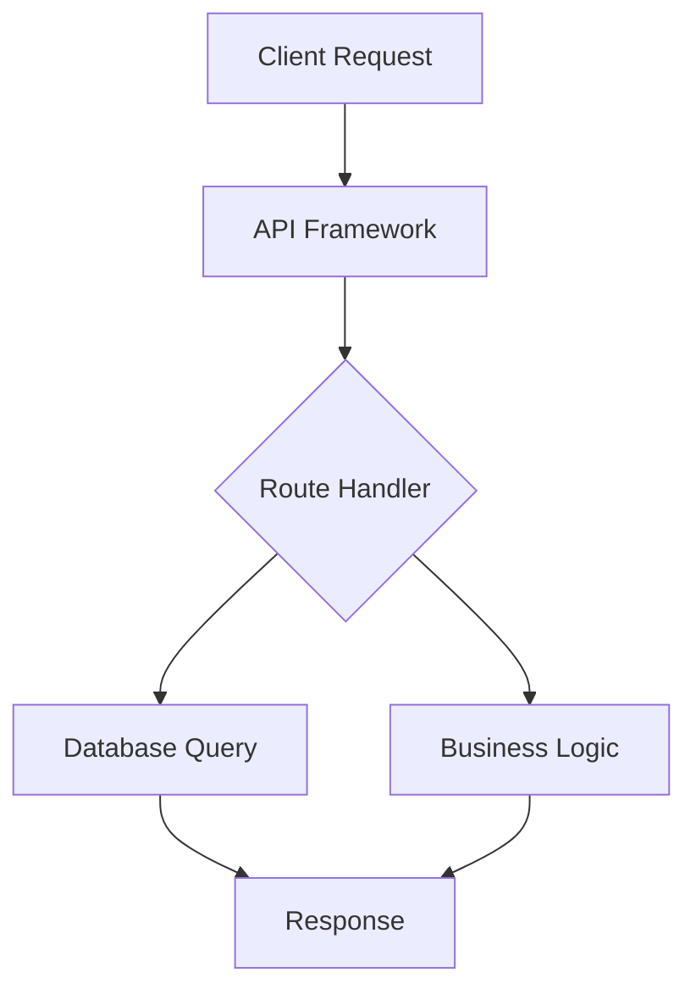

# idae-api

A flexible and extensible API framework for Node.js, designed to work with multiple database types and configurations.

## Architecture



## Features

- Modular architecture
- Dynamic database management
- Flexible routing
- TypeScript support

## Installation

```bash
npm install @medyll/idae-api
# or
pnpm add @medyll/idae-api
```

## Documentation

For more information, visit the [main documentation](../../README.md)

## License

MIT
