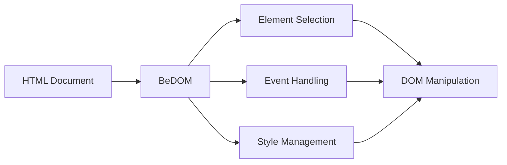

# idae-be

A modern DOM manipulation library with callback-based element targeting, event handling, and style management.

## Architecture



## Features

- Advanced DOM traversal
- Precise element targeting
- Event handling
- Style management
- Attribute control

## Installation

```bash
npm install @medyll/idae-be
# or
pnpm add @medyll/idae-be
```

## Documentation

For more information, visit the [main documentation](../../README.md)

## License

MIT
