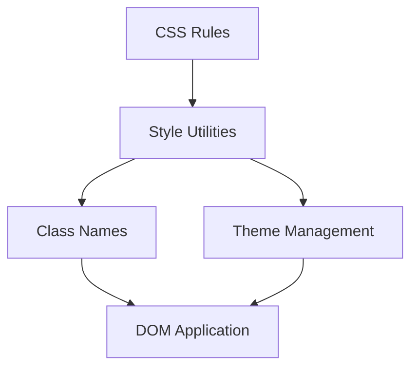

# idae-csss

CSS and Style utility library for the Idae ecosystem.

## Architecture



## Features

- Style utilities
- Class composition
- Theme management
- Responsive design

## Installation

```bash
npm install @medyll/idae-csss
pnpm add @medyll/idae-csss
```

## Documentation

For more information, visit the [main documentation](../../README.md)

## License

MIT
