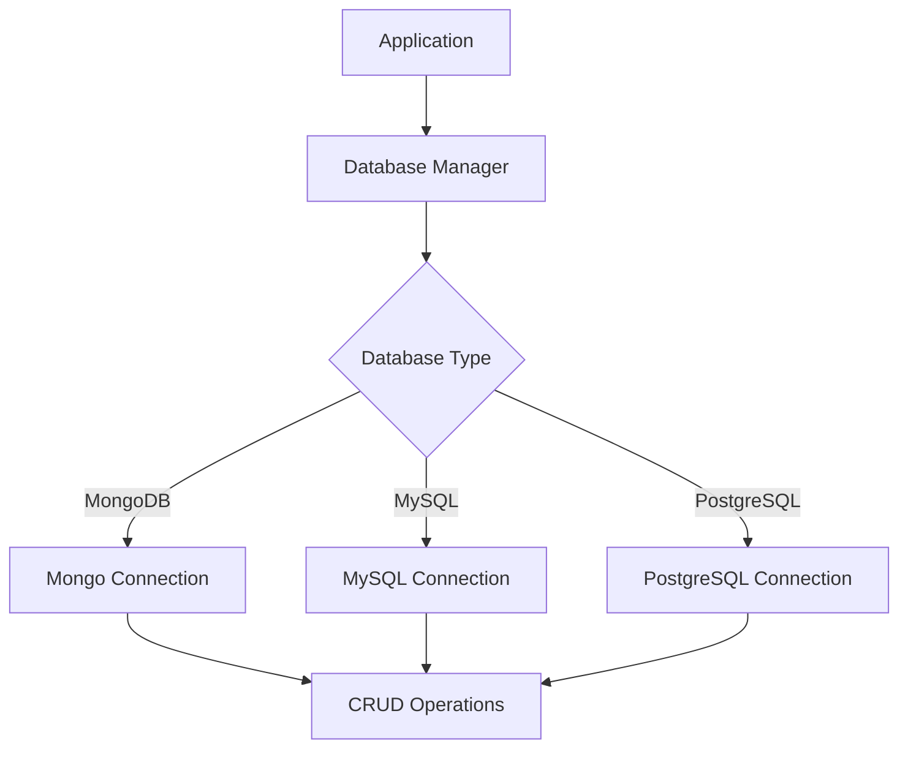

# idae-db

A flexible database interaction library with focus on MongoDB, offering connection management, API, and CRUD operations.

## Architecture



## Features

- Multi-database support
- Connection pooling
- CRUD operations
- Query builder
- Transaction support

## Installation

```bash
npm install @medyll/idae-db
pnpm add @medyll/idae-db
```

## Documentation

For more information, visit the [main documentation](../../README.md)

## License

MIT
