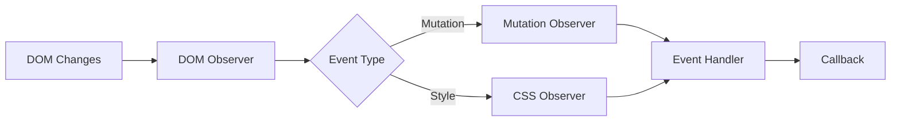

# idae-dom-events

A library for observing and reacting to DOM changes, tracking CSS changes, and monitoring mutations.

## Architecture



## Features

- DOM mutation tracking
- CSS change detection
- Event handlers
- Efficient observation
- Dynamic updates

## Installation

```bash
npm install @medyll/idae-dom-events
pnpm add @medyll/idae-dom-events
```

## Documentation

For more information, visit the [main documentation](../../README.md)

## License

MIT
