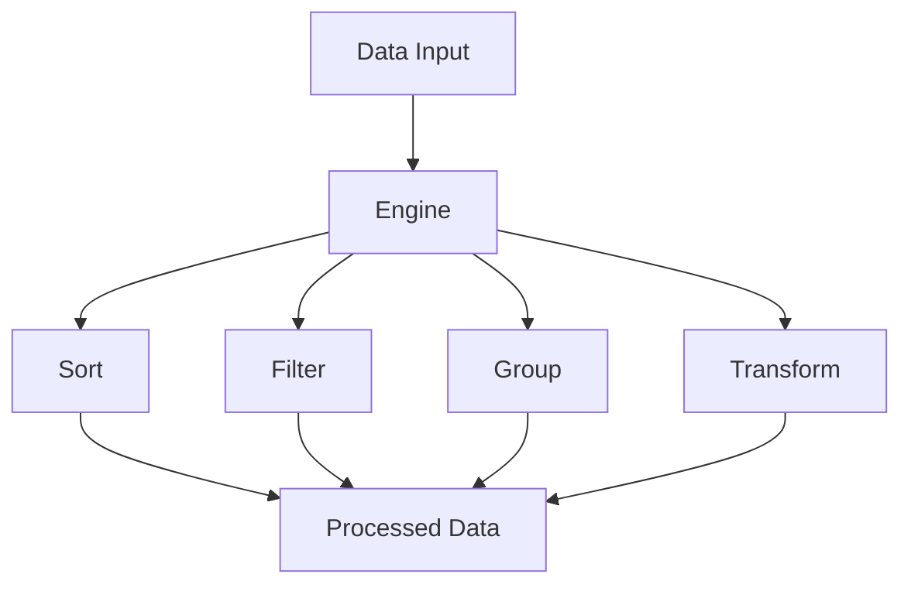

# idae-engine

A powerful TypeScript library for data manipulation operations like sorting, finding, and grouping.

## Architecture



## Features

- Sorting utilities
- Filtering operations
- Grouping functions
- Data transformation
- Type-safe operations

## Installation

```bash
npm install @medyll/idae-engine
pnpm add @medyll/idae-engine
```

## Documentation

For more information, visit the [main documentation](../../README.md)

## License

MIT
