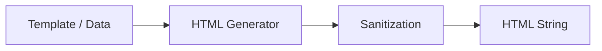

# idae-html

**Package Manager**: This package is part of the Idae monorepo, which uses **pnpm** for dependency and script management. Use `pnpm install`, `pnpm run`, etc. to ensure consistency.

## Overview


`idae-html` provides utilities and helpers for HTML generation, parsing, and manipulation in JavaScript/TypeScript projects. It is designed to be used both in browser and Node.js environments.

### Monorepo Dependencies
- `@medyll/idae-dom-events`: DOM event helpers and advanced event-driven logic (see `src/lib/main.ts`).
- `idae-idbql`: IndexedDB query layer for client-side persistence (used in advanced scenarios; see monorepo for details).
- `@medyll/idae-stator`: state management and reactivity utilities (used for advanced stateful UI/data flows; see monorepo for usage patterns).

## Features
- HTML string generation and templating
- Safe escaping and sanitization helpers
- DOM parsing and manipulation utilities
- Integrates with other Idae packages for UI, data flow, and state management

## Persistence (IndexedDB)

This package exposes optional helpers that integrate with the monorepo's IndexedDB query layer `@medyll/idae-idbql` when that package is available in the workspace/runtime. The core runtime (`core`) will provide the following helpers when `idae-idbql` is present:

- `core.createIdbqDb(model, version)` — create an IndexedDB instance for the given model and version.
- `core.createIdbqlState(idbqlInstance, options)` — create a reactive state surface for use in UI examples.
- `core.idbql` — passthrough to the idbql API when available.

These helpers are optional: `idae-html` will still work without `idae-idbql` installed, but persistence-related helpers will be `undefined`.

Example (browser/demo usage):

```js
import { core } from '/packages/idae-html/src/lib/core-engine.js';

// minimal model example
const model = {
  notes: { keyPath: '++id, created_at' }
};

// create DB (if helper is present)
if (core.createIdbqDb) {
  const store = core.createIdbqDb(model, 1);
  const { idbql, idbqlState } = store.create('demo-db');

  // add a note
  idbql.notes.add({ content: 'hello', created_at: Date.now() });

  // reactive state (optional)
  if (core.createIdbqlState) {
    const state = core.createIdbqlState(idbql);
    // use state in examples or derived UI
  }
}
```

## Usage
Import the required helpers from the package:
```js
import { html, escapeHtml, parseHtml } from '@medyll/idae-html';

const markup = html`<div>${escapeHtml(userInput)}</div>`;
const dom = parseHtml(markup);
```

## Slots (insertion de contenu)

`idae-html` fournit des utilitaires légers pour supporter un modèle de `slot` (injection de contenu enfant)
en utilisant le parsing DOM — ce qui est robuste côté client et compatible avec JSDOM côté serveur.

- `core.renderHtmlWithSlots(template, slots, options)`
  - `template: string | Node` — HTML template contenant des éléments `<slot>`.
  - `slots: Record<string, string|Node>` — contenu à injecter. La clef `default` correspond au slot non nommé.
  - `options.allowHtml?: boolean` — quand `true`, les valeurs de type `string` sont interprétées comme HTML (par défaut elles sont insérées comme texte).
  - Retourne un `DocumentFragment` prêt à être inséré dans le DOM.

- `core.applySlotsToElement(root, slots, options)` — applique les slots à un `ParentNode` existant.

Comportements pris en charge :
- `<slot name="header"></slot>` — slot nommé `header`.
- `<slot>fallback</slot>` — contenu de fallback si aucun contenu fourni.
- Slot non nommé → clé `default` dans l'objet `slots`.

Exemple rapide :

```js
import { core } from '/packages/idae-html/src/lib/core-engine.ts';

const tpl = `
  <section>
    <header><slot name="header">Fallback header</slot></header>
    <div><slot>Fallback body</slot></div>
  </section>`;

const frag = core.renderHtmlWithSlots(tpl, {
  header: '<h3>Injected header</h3>',
  default: '<p>Injected body</p>'
}, { allowHtml: true });

document.body.appendChild(frag);
```

Sécurité : par défaut, les valeurs `string` sont insérées comme texte (échappées). N'utilisez `allowHtml: true` que pour du HTML de confiance.


## Components registry

This package provides a small, opinionated registry for initialising HTML components in demos and pages.

- Register an initializer: `core.registerComponent(name, spec)` — `spec` may be either a function (legacy) or an object `{ script: (root)=>{}, style?: string, meta?: {...} }`.
  - If `spec` is a function it is treated as the `script` initializer for backwards compatibility.
  - The recommended, normative shape is an object with a `script` property:

```js
core.registerComponent('dropdown', {
  script(root){
    // initializer runs with the component root element
  },
  style: '/* optional component-level CSS string to inject */',
  meta: { author: 'you' }
});
```
- Mark component roots in markup with `data-component="<name>"` and scope runtime selectors inside the component root to avoid global IDs.
- Helpers: `core.initComponent(name, root?)`, `core.initRegisteredComponents(root?)`, `core.autoInitRegisteredComponents()`.
- Example:

```html
<div data-component="dropdown">
  <button data-trigger>Open</button>
  <div data-menu>...</div>
</div>

<script type="module">
  import { core } from '/packages/idae-html/src/lib/core-engine.ts';
  core.registerComponent('dropdown', {
    script(root){
      // init dropdown inside `root`
    }
  });
</script>
```

Using `data-component` keeps components composable and avoids global ID collisions in examples.

## CSSS support (lang="csss")

Component `<style>` blocks may declare `lang="csss"`. During build the scripts will attempt to compile `csss` to plain CSS using the local `idae-csss` module and emit standard `<style>` in the built output. If the compiler is unavailable or fails, the original contents are emitted as-is.

If you author component styles using the `csss` syntax, add `lang="csss"` to the `<style>` tag in component HTML files (examples updated in `src/lib/components`).

## Build & Test
- Build: `pnpm run build`
- Test: `pnpm run test`
- Lint/format: `pnpm run lint && pnpm run format`

## Contributing
- Follow the monorepo conventions for code style and commit messages.
- Add tests for new features or bug fixes.
- See the monorepo root README for more details.

---

For more, see the monorepo documentation or contact the maintainers.


## Architecture


