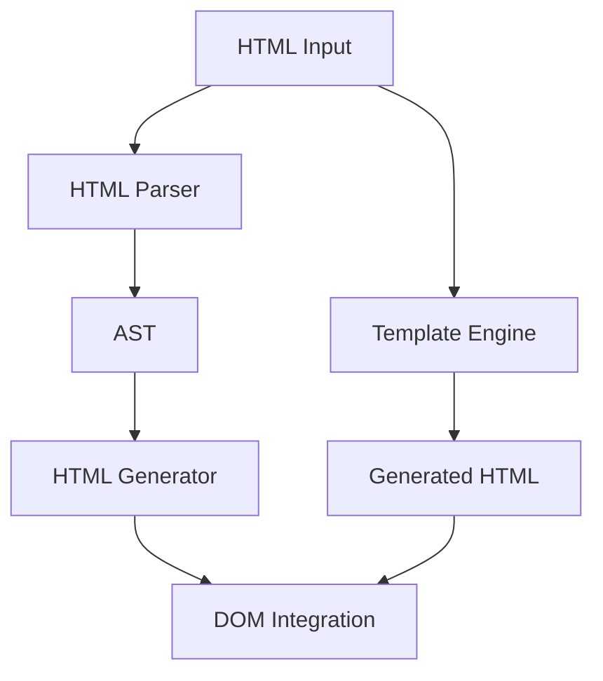

# idae-html

Raw HTML utility library for dynamic web apps, providing HTML generation, parsing, and manipulation.

## Architecture


```mermaid
graph TD
    A[HTML Input] --> B[HTML Parser]
    B --> C[AST]
    C --> D[HTML Generator]
    D --> E[DOM Integration]
    A --> F[Template Engine]
    F --> G[Generated HTML]
    G --> E
```

## Features

- HTML generation
- HTML parsing
- DOM manipulation
- Template rendering
- Svelte/React-inspired API

## Installation

```bash
npm install @medyll/idae-html
pnpm add @medyll/idae-html
```

## Documentation

For more information, visit the [main documentation](../../README.md)

## License

MIT
