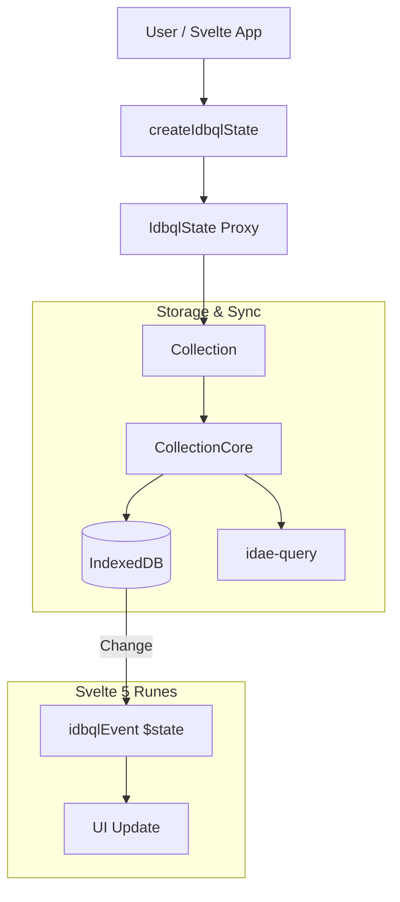

# @medyll/idae-idbql


# @medyll/idae-idbql

A flexible, high-performance state-full IndexedDB query library for TypeScript and JavaScript, with a focus on performance and ease of use.


## Features

- Object-like query interface for IndexedDB
- Strong TypeScript support with full type inference
- Reactive state management for real-time UI updates
- Support for complex CRUD operations and advanced querying
- Flexible data modeling with automatic schema creation
- Built-in indexing and query optimization helpers
- Seamless integration with frontend frameworks, especially Svelte
- Robust error handling and logging
- Versioning and database migration support
- First-class support for Svelte 5 reactivity
- Full compatibility with `@medyll/idae-stator` for alternative reactive state management  
- Cross-browser compatibility (Chrome, Firefox, Safari, Edge)
-

## Installation

```bash
pnpm add @medyll/idae-idbql
```

## Quick Start

```typescript
import { createIdbqDb } from '@medyll/idae-idbql';

// Define your data model
const exampleModel = {
  messages: {
    keyPath: '++id, chatId, created_at',
    ts: {} as ChatMessage,
  },
  chat: {
    keyPath: '&chatId, created_at, dateLastMessage',
    ts: {} as Chat,
  },
};

// Create a database instance
const idbqStore = createIdbqDb(exampleModel, 1);
const { idbql, idbqlState } = idbqStore.create('myDatabase');

// Perform database operations
async function fetchMessages() {
  const messages = await idbql.messages.where({ chatId: '123' }).toArray();
  console.log(messages);
}

fetchMessages();
```

## API Reference

- `createIdbqDb(model, version)` — create an IndexedDB instance for the given model and version.
- `idbql` — main CRUD/query interface for each collection defined in the model.
- `idbqlState` — reactive state surface exposing collection snapshots and query helpers.
- `idbDatabase` — low-level access to the underlying IndexedDB instance.

## Query Operations

```typescript
// Add a new item
await idbql.messages.add({ chatId: '123', content: 'Hello' });

// Update an item
await idbql.messages.put({ id: 1, content: 'Updated message' });

// Delete an item
await idbql.messages.delete(1);

// Query items
const recentMessages = await idbql.messages
  .where({ created_at: { $gt: new Date(Date.now() - 86400000) } })
  .toArray();

// Count all documents in a collection (fast, uses native IndexedDB count)
const totalMessages = await idbql.messages.count();

// Count documents matching a query (retrieves and filters matching documents)
const unreadCount = await idbql.messages.count({ isRead: false });

// Count with complex queries
const recentUnreadCount = await idbql.messages.count({
  isRead: false,
  created_at: { $gt: new Date(Date.now() - 86400000) }
});
```

### Using `count()` with `idbqlState`

```ts
// Reactive count in Svelte 5 components
const unreadMessages = $derived(() => idbqlState.messages.count({ isRead: false }));

// Count all items (uses native IndexedDB count for optimal performance)
const totalMessages = await idbqlState.messages.count();
```

> Note: `count()` without parameters uses the native IndexedDB `count()` for optimal performance. When given a query, it retrieves matching documents and returns the filtered count.

## Transactions

idbql supports transactions across multiple object stores:

```typescript
const result = await idbql.transaction(['users', 'posts'], 'readwrite', async (tx) => {
  const userStore = tx.objectStore('users');
  const postStore = tx.objectStore('posts');

  const userId = await userStore.add({ name: 'Alice', email: 'alice@example.com' });
  const postId = await postStore.add({ userId, title: "Alice's First Post", content: 'Hello, World!' });

  return { userId, postId };
});
```

## Svelte 5 Reactivity: Usage & Best Practices

`idbqlState` exposes a reactive Svelte 5 state (`$state`). Any database modification (add, update, delete) is propagated to queries (`where`, `groupBy`, `sort`, etc.) used inside `$derived` or `$effect`.

### Example: reactive list in a Svelte 5 component

```svelte
<script lang="ts">
  import { idbqlState } from './store';

  // Use $derived to produce a reactive list
  const activeUsers = $derived(() => idbqlState.users.where({ isActive: true }));
</script>

<h2>Active users</h2>
{#each $activeUsers as user}
  <p>{user.name}</p>
{/each}
```

### Notes

- Methods such as `where`, `groupBy`, and `sort` operate synchronously on the current snapshot of the state.
- Use them inside `$derived` or `$effect` to get reactive updates.

## Stator Integration (optional)

`@medyll/idae-idbql` now supports an optional, opt-in adapter that lets you back collection state with `@medyll/idae-stator` instead of (or alongside) the default Svelte 5 reactive surface. This gives consumers an alternative reactivity model while keeping current Svelte 5 usage fully supported and non-breaking.

- **How it works**: when you call `createIdbqlState(idbBase, options)` you may pass `options.adapter` set to either `"svelte"` (default) or `"stator"`. When `"stator"` is selected the library creates a Stator adapter and registers it with the internal `idbqlEvent` bus. Events applied to the Svelte state are mirrored to the Stator adapter by the event bus, so both reactivity models reflect DB changes.

- **Install companion package**:

```bash
pnpm add @medyll/idae-stator
```

- **Create state with Stator adapter**:

```ts
import { createIdbqDb, createIdbqlState } from '@medyll/idae-idbql';

const model = { /* your model */ };
const idbqStore = createIdbqDb(model, 1);
const { idbql } = idbqStore.create('myDatabase');

// Create reactive state backed by idae-stator
const state = createIdbqlState(idbql, {
  adapter: 'stator', // or 'svelte'
  adapterOptions: {}, // optional adapter-specific options
});

// Use state.collectionState or state.qolie('collection') as usual
```

- **Adapter behavior & API**

  - The adapter implements `getCollectionState(name)`, `applyEvent(event)` and `dispose()` and is registered with `idbqlEvent.registerAdapter(...)`.
  - The internal event bus (`idbqlEvent`) keeps a Svelte `$state` mirror and delegates every state-changing event to the adapter (if present). Adapter errors are caught to avoid breaking the primary flow.
  - Supported event types: `set`, `add`, `put`, `update`, `updateWhere`, `delete`, `deleteWhere`.

- **Coexistence**

  - The adapter is opt-in and non-breaking: the default remains Svelte 5 runes (`$state`, `$derived`, `$effect`). Enabling the Stator adapter mirrors events so both the Svelte and Stator surfaces stay in sync.
  - This enables projects that prefer Stator proxies or polyglot apps that use different reactivity solutions in different layers.

- **Migration notes**

  - To switch an existing app to Stator-backed state: install `@medyll/idae-stator`, set `adapter: 'stator'` when calling `createIdbqlState`, and update any consumer code that reads `idbqlEvent.dataState` to instead use the Stator collection proxies via the adapter's `getCollectionState()` if you want to access the Stator objects directly.
  - If you rely on Svelte runes in UI code, you can keep using them; the event bus will continue to update the Svelte surface.

If you have questions about adapter options or need additional adapter features (deduplication, change batching, custom keyPath detection), open an issue or a PR with a proposal.

## Versioning and Migrations

```typescript
const idbqStore = createIdbqDb(myModel, 2);
const { idbDatabase } = idbqStore.create('myDb', {
  upgrade(oldVersion, newVersion, transaction) {
    if (oldVersion < 2) {
      const userStore = transaction.objectStore('users');
      userStore.createIndex('emailIndex', 'email', { unique: true });
    }
  },
});
```

## Error Handling

```typescript
try {
  await idbql.users.add({ username: 'existing_user' });
} catch (error) {
  if (error instanceof UniqueConstraintError) {
    console.error('Username already exists');
  } else {
    console.error('An unexpected error occurred', error);
  }
}
```

## Performance Tips

- Use appropriate indexes.
- Limit result sets with `.limit(n)`.
- Use `.count()` instead of `.toArray().length` for counting documents.
- When counting all documents, `count()` (without parameters) uses native IndexedDB for optimal performance.
- When counting with filters, `count(query)` retrieves matching documents — consider using indexes for better performance.

## Contributing

Contributions are welcome! Please read our [CONTRIBUTING.md](CONTRIBUTING.md) for the contribution process and code of conduct.

## Architecture



## License

This project is licensed under the MIT License. See the [LICENSE](LICENSE) file for details.

## Support

If you encounter issues or have questions, please open an issue on the repository.


## License

This project is licensed under the MIT License. See the [LICENSE](LICENSE) file for details.

## Support

If you encounter any issues or have questions, please file an issue on the GitHub repository.

## Extended Examples & Developer Notes

- **Package scripts (monorepo / pnpm)**

```bash
pnpm install
pnpm run build    # build the package
pnpm run check    # type checks
pnpm run test     # run unit tests (vitest)
```

- **Quick Svelte 5 usage (reactive list)**

```svelte
<script lang="ts">
  import { createIdbqDb, createIdbqlState } from '@medyll/idae-idbql';

  const model = { users: { keyPath: '++id', ts: {} as User } };
  const db = createIdbqDb(model, 1);
  const { idbql } = db.create('app');

  // default uses Svelte runes for reactivity
  const state = createIdbqlState(idbql, { adapter: 'svelte' });
  const users = $derived(() => state.qolie('users').where({ isActive: true }));
</script>

{#each $users as user}
  <div>{user.name}</div>
{/each}
```

- **Using Stator as the reactive surface**

```ts
import { createIdbqDb, createIdbqlState } from '@medyll/idae-idbql';
import { stator } from '@medyll/idae-stator';

const model = { notes: { keyPath: '++id', ts: {} as Note } };
const db = createIdbqDb(model, 1);
const { idbql } = db.create('app');

// Create a Stator-backed state
const state = createIdbqlState(idbql, { adapter: 'stator' });
// Access the underlying Stator collection proxy if needed:
// const statorCollection = state.collectionState.notes; // or via adapter.getCollectionState('notes')
```

- **Adapter internals / reference files**

  - The Stator adapter implementation is in `src/lib/state/statorAdapter.ts`.
  - The event-bus and Svelte state mirror live in `src/lib/state/idbqlEvent.svelte.ts`.
  - The public state factory is `src/lib/state/idbstate.svelte.ts` (exports `createIdbqlState`).

- **Testing & contribution tips**

  - Tests live under `src/` next to the modules and use `vitest`.
  - Run `pnpm run test` to execute the suite. Add unit tests for adapter behavior when changing reactivity logic.
  - Follow TypeScript typing conventions: update `src/lib/idbqlCore/types.ts` when changing public types.

If you'd like, I can add a short example project demonstrating both Svelte and Stator flows, or open a small integration test that exercises the adapter mirroring behavior.
 