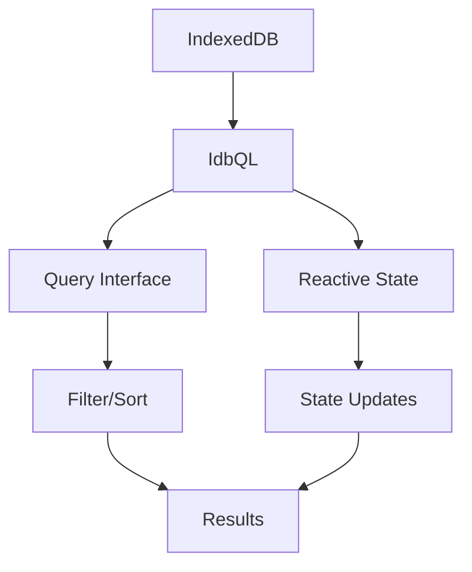

# idae-idbql

A powerful IndexedDB query library with MongoDB-like interface, TypeScript support, and reactive state management.

## Architecture


```mermaid
graph TD
    A[IndexedDB] --> B[IdbQL]
    B --> C[Query Interface]
    B --> D[Reactive State]
    C --> E[Filter/Sort]
    D --> F[State Updates]
    E --> G[Results]
    F --> G
```

## Features

- MongoDB-like queries
- IndexedDB backend
- Reactive state
- TypeScript support
- Framework integration

## Installation

```bash
npm install @medyll/idae-idbql
pnpm add @medyll/idae-idbql
```

## Documentation

For more information, visit the [main documentation](../../README.md)

## License

MIT
