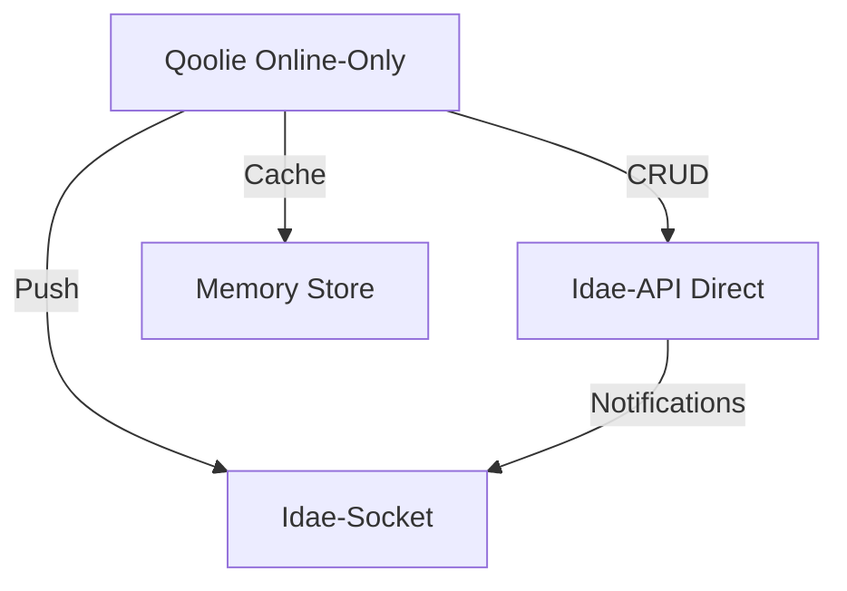
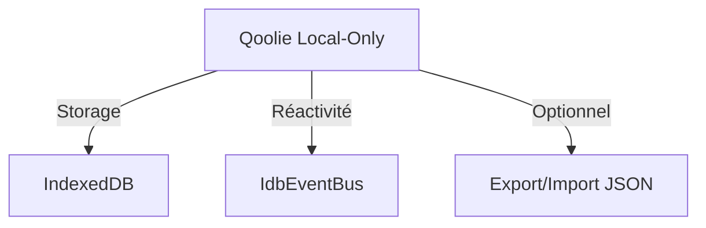
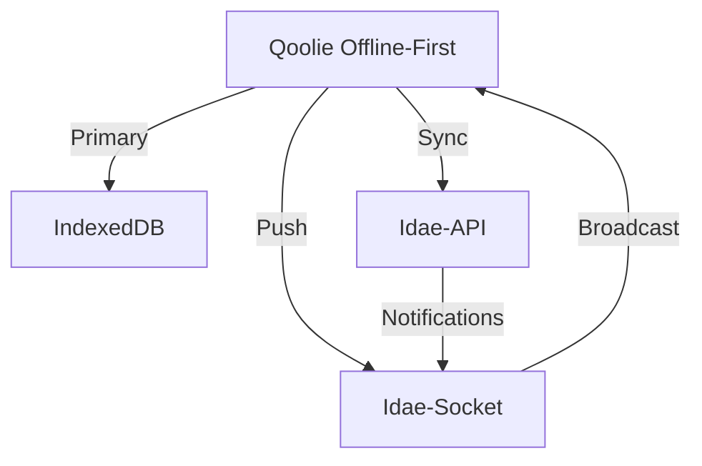

# Qoolie Next - Architecture Multi-Mode

## Contexte

Après analyse approfondie du code existant, il apparaît que Qoolie peut effectivement évoluer vers une architecture multi-mode avec des modifications ciblées. Les briques nécessaires existent déjà et permettent une implémentation à moindre coût.

## Architecture Actuelle

### Modes existants
- **mobile-first** (offline-first avec sync optimiste)
- **server-first** (sync avec validation serveur avant mise à jour locale)
- **sync: false** (local-only, IndexedDB seulement)

### Composants clés
- **IdaeEventEmitter** : Système de hooks pre/post dans Idae-DB
- **SocketIOListener** : Intégration client avec Idae-Socket
- **SyncController** : Gestion de la synchronisation
- **HydrationController** : Hydratation des données

## Architecture Cible

### Nouveaux modes à implémenter

#### 1. Mode Online-Only


**Caractéristiques** :
- Pas d'IndexedDB (storage en mémoire seulement)
- Appels API directs
- Réactivité via WebSocket
- Cache temporaire en mémoire

#### 2. Mode Local-Only (amélioré)


**Caractéristiques** :
- IndexedDB seulement
- Pas de synchronisation
- Export/import pour sauvegarde
- Réactivité complète

#### 3. Mode Offline-First (existant, amélioré)


**Améliorations** :
- Synchronisation des hooks serveur
- Notifications temps réel bidirectionnelles
- Résolution de conflits améliorée

## Modifications Nécessaires

### 1. Nouveau système de storage abstrait

```typescript
// src/lib/storage/StorageAdapter.ts
interface StorageAdapter<T> {
  create(data: T): Promise<T>;
  update(id: string, data: Partial<T>): Promise<T>;
  delete(id: string): Promise<boolean>;
  get(id: string): Promise<T | undefined>;
  getAll(): T[];
  where(query: Query): T[];
  on(event: string, listener: Function): void;
  off(event: string, listener: Function): void;
}

// Implémentations
class IdbStorageAdapter implements StorageAdapter { /* existant */ }
class MemoryStorageAdapter implements StorageAdapter { /* nouveau */ }
class ApiStorageAdapter implements StorageAdapter { /* nouveau */ }
```

### 2. Modification de l'initialisation

```typescript
// src/lib/Qoolie.ts
class Qoolie {
  constructor(options: QoolieOptions) {
    // Déterminer le mode
    this._mode = options.mode ?? (options.sync ? 'offline-first' : 'local-only');
    
    // Initialiser le storage adapté
    switch (this._mode) {
      case 'online-only':
        this._storage = new ApiStorageAdapter(options.apiClient);
        this._sync = new NoopSyncAdapter();
        break;
      case 'local-only':
        this._storage = new IdbStorageAdapter();
        this._sync = new NoopSyncAdapter();
        break;
      default: // offline-first
        this._storage = new IdbStorageAdapter();
        this._sync = new FullSyncAdapter(options.sync);
    }
    
    // Toujours supporter les notifications socket
    if (options.socketClient) {
      this._socket = options.socketClient;
      this._setupSocketListeners();
    }
  }
}
```

### 3. Intégration des hooks serveur

```typescript
// Dans Idae-API (à implémenter)
import { IdaeDb } from '@medyll/idae-db';
import { SocketServer } from '@medyll/idae-socket';

// Initialisation
const db = new IdaeDb({...});
const socketServer = new SocketServer(3001);

// Connexion des hooks
 db.registerEvents({
   create: {
     post: (result, data) => {
       socketServer.broadcast('db:create', {
         collection: 'users',
         data: result
       });
     }
   },
   update: {
     post: (result, data) => {
       socketServer.broadcast('db:update', {
         collection: 'users',
         id: data.id,
         data: result
       });
     }
   },
   delete: {
     post: (result, data) => {
       socketServer.broadcast('db:delete', {
         collection: 'users',
         id: data.id
       });
     }
   }
 });
```

### 4. Réactivité en mode online-only

```typescript
// src/lib/storage/ApiStorageAdapter.ts
class ApiStorageAdapter implements StorageAdapter {
  private _state: Map<string, any> = new Map();
  private _listeners: Map<string, Function[]> = new Map();
  
  constructor(private _apiClient: IdaeApiClient) {}
  
  async create(data: T): Promise<T> {
    const result = await this._apiClient.collection.create(data);
    this._state.set(result.id, result);
    this._emit('create', result);
    this._emit('change');
    return result;
  }
  
  getAll(): T[] {
    return Array.from(this._state.values());
  }
  
  on(event: string, listener: Function) {
    if (!this._listeners.has(event)) {
      this._listeners.set(event, []);
    }
    this._listeners.get(event)?.push(listener);
  }
  
  private _emit(event: string, ...args: any[]) {
    this._listeners.get(event)?.forEach(fn => fn(...args));
  }
}
```

## Bénéfices

### 1. Flexibilité accrue
- Choix du mode adapté à chaque application
- Migration facile entre modes
- Meilleure adaptation aux différents cas d'usage

### 2. Performance optimisée
- Mode online-only sans overhead IndexedDB
- Réactivité temps réel via WebSocket
- Cache intelligent selon le mode

### 3. Architecture cohérente
- Même API pour tous les modes
- Intégration transparente avec Idae-Socket
- Gestion unifiée des événements

### 4. Évolutivité
- Ajout facile de nouveaux modes
- Intégration avec d'autres services
- Meilleure séparation des concerns

## Roadmap d'Implémentation

### Phase 1: Fondations (2-3 semaines)
- [ ] Créer l'interface StorageAdapter
- [ ] Implémenter MemoryStorageAdapter
- [ ] Implémenter ApiStorageAdapter
- [ ] Modifier l'initialisation de Qoolie
- [ ] Tests unitaires des nouveaux adapters

### Phase 2: Intégration Serveur (1-2 semaines)
- [ ] Intégrer Idae-Socket dans Idae-API
- [ ] Connecter les hooks DB aux WebSockets
- [ ] Implémenter le broadcast des événements
- [ ] Tests d'intégration

### Phase 3: Réactivité et Optimisations (2 semaines)
- [ ] Réactivité Svelte pour tous les modes
- [ ] Gestion du cache et invalidation
- [ ] Optimisation des performances
- [ ] Tests de charge

### Phase 4: Documentation et Exemples (1 semaine)
- [ ] Documentation des nouveaux modes
- [ ] Exemples pour chaque cas d'usage
- [ ] Migration guide
- [ ] Benchmarks comparatifs

## Coût Estimé

- **Effort** : 6-8 semaines de développement
- **Complexité** : Moyenne (modifications ciblées)
- **Risque** : Faible (briques existantes réutilisées)
- **Bénéfice** : Élevé (flexibilité et performance)

## Conclusion

L'évolution de Qoolie vers une architecture multi-mode est réalisable avec les briques existantes. Les modifications nécessaires sont ciblées et permettent de conserver la compatibilité tout en ajoutant de nouvelles fonctionnalités. Cette approche offre le meilleur compromis entre effort de développement et valeur ajoutée pour les utilisateurs.
