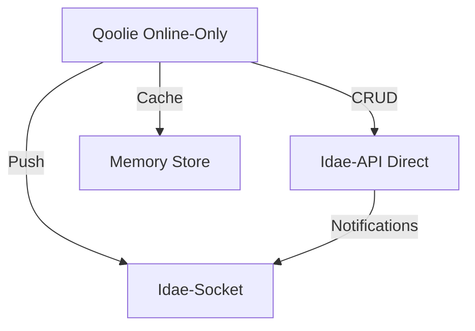
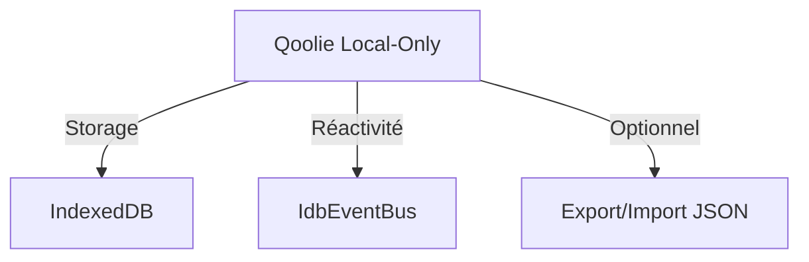
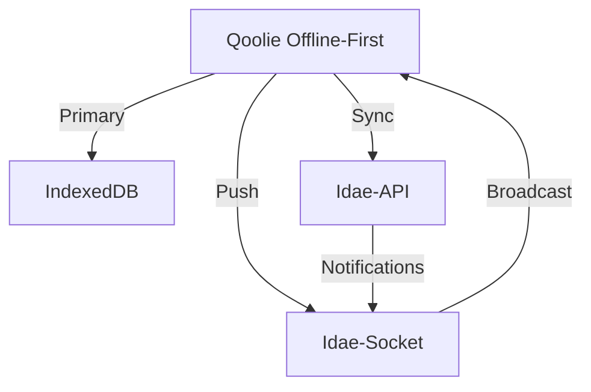

# Qoolie Next - Architecture Multi-Mode

## Contexte

Après analyse approfondie du code existant, il apparaît que Qoolie peut effectivement évoluer vers une architecture multi-mode avec des modifications ciblées. Les briques nécessaires existent déjà et permettent une implémentation à moindre coût.

## Stratégie de Développement Sans Branches

**Contraintes du monorepo** :
- Pas de branches longues (tout se fait sur main/dev)
- Déploiement continu
- Compatibilité ascendante absolue requise

**Approche adoptée** :
- Développement incrémental par petites commits atomiques
- Feature flags pour les nouvelles fonctionnalités
- Tests de non-régression avant chaque commit
- Documentation des contrats d'API existants

## Architecture Actuelle

### Modes existants
- **mobile-first** (offline-first avec sync optimiste)
- **server-first** (sync avec validation serveur avant mise à jour locale)
- **sync: false** (local-only, IndexedDB seulement)

### Composants clés
- **IdaeEventEmitter** : Système de hooks pre/post dans Idae-DB
- **SocketIOListener** : Intégration client avec Idae-Socket
- **SyncController** : Gestion de la synchronisation
- **HydrationController** : Hydratation des données

## Architecture Cible

### Nouveaux modes à implémenter

#### 1. Mode Online-Only


**Caractéristiques** :
- Pas d'IndexedDB (storage en mémoire seulement)
- Appels API directs
- Réactivité via WebSocket
- Cache temporaire en mémoire

#### 2. Mode Local-Only (amélioré)


**Caractéristiques** :
- IndexedDB seulement
- Pas de synchronisation
- Export/import pour sauvegarde
- Réactivité complète

#### 3. Mode Offline-First (existant, amélioré)


**Améliorations** :
- Synchronisation des hooks serveur
- Notifications temps réel bidirectionnelles
- Résolution de conflits améliorée

## Modifications Nécessaires

### 1. Nouveau système de storage abstrait

```typescript
// src/lib/storage/StorageAdapter.ts
interface StorageAdapter<T> {
  create(data: T): Promise<T>;
  update(id: string, data: Partial<T>): Promise<T>;
  delete(id: string): Promise<boolean>;
  get(id: string): Promise<T | undefined>;
  getAll(): T[];
  where(query: Query): T[];
  on(event: string, listener: Function): void;
  off(event: string, listener: Function): void;
}

// Implémentations
class IdbStorageAdapter implements StorageAdapter { /* existant */ }
class MemoryStorageAdapter implements StorageAdapter { /* nouveau */ }
class ApiStorageAdapter implements StorageAdapter { /* nouveau */ }
```

### 2. Modification de l'initialisation

```typescript
// src/lib/Qoolie.ts
class Qoolie {
  constructor(options: QoolieOptions) {
    // Déterminer le mode
    this._mode = options.mode ?? (options.sync ? 'offline-first' : 'local-only');
    
    // Initialiser le storage adapté
    switch (this._mode) {
      case 'online-only':
        this._storage = new ApiStorageAdapter(options.apiClient);
        this._sync = new NoopSyncAdapter();
        break;
      case 'local-only':
        this._storage = new IdbStorageAdapter();
        this._sync = new NoopSyncAdapter();
        break;
      default: // offline-first
        this._storage = new IdbStorageAdapter();
        this._sync = new FullSyncAdapter(options.sync);
    }
    
    // Toujours supporter les notifications socket
    if (options.socketClient) {
      this._socket = options.socketClient;
      this._setupSocketListeners();
    }
  }
}
```

### 3. Intégration des hooks serveur

```typescript
// Dans Idae-API (à implémenter)
import { IdaeDb } from '@medyll/idae-db';
import { SocketServer } from '@medyll/idae-socket';

// Initialisation
const db = new IdaeDb({...});
const socketServer = new SocketServer(3001);

// Connexion des hooks
 db.registerEvents({
   create: {
     post: (result, data) => {
       socketServer.broadcast('db:create', {
         collection: 'users',
         data: result
       });
     }
   },
   update: {
     post: (result, data) => {
       socketServer.broadcast('db:update', {
         collection: 'users',
         id: data.id,
         data: result
       });
     }
   },
   delete: {
     post: (result, data) => {
       socketServer.broadcast('db:delete', {
         collection: 'users',
         id: data.id
       });
     }
   }
 });
```

### 4. Réactivité en mode online-only

```typescript
// src/lib/storage/ApiStorageAdapter.ts
class ApiStorageAdapter implements StorageAdapter {
  private _state: Map<string, any> = new Map();
  private _listeners: Map<string, Function[]> = new Map();
  
  constructor(private _apiClient: IdaeApiClient) {}
  
  async create(data: T): Promise<T> {
    const result = await this._apiClient.collection.create(data);
    this._state.set(result.id, result);
    this._emit('create', result);
    this._emit('change');
    return result;
  }
  
  getAll(): T[] {
    return Array.from(this._state.values());
  }
  
  on(event: string, listener: Function) {
    if (!this._listeners.has(event)) {
      this._listeners.set(event, []);
    }
    this._listeners.get(event)?.push(listener);
  }
  
  private _emit(event: string, ...args: any[]) {
    this._listeners.get(event)?.forEach(fn => fn(...args));
  }
}
```

## Bénéfices

### 1. Flexibilité accrue
- Choix du mode adapté à chaque application
- Migration facile entre modes
- Meilleure adaptation aux différents cas d'usage

### 2. Performance optimisée
- Mode online-only sans overhead IndexedDB
- Réactivité temps réel via WebSocket
- Cache intelligent selon le mode

### 3. Architecture cohérente
- Même API pour tous les modes
- Intégration transparente avec Idae-Socket
- Gestion unifiée des événements

### 4. Évolutivité
- Ajout facile de nouveaux modes
- Intégration avec d'autres services
- Meilleure séparation des concerns

## Analyse de Risque et Compatibilité

### Ce qui NE DOIT PAS être cassé 🚫
1. **API publique de Qoolie**
   - `createQoolie(options)`
   - `qoolie.collection(name)`
   - Toutes les méthodes CRUD existantes
   - Comportement par défaut inchangé

2. **Modes existants**
   - mobile-first (offline-first)
   - server-first
   - local-only (`sync: false`)

3. **Intégrations**
   - Idae-API (sync)
   - Idae-Socket (client)
   - Tous les adapteurs framework

### Stratégie de Non-Régression ✅

```typescript
// 1. Nouveaux fichiers uniquement
src/lib/storage/ApiStorageAdapter.ts    // NOUVEAU
src/lib/storage/MemoryStorageAdapter.ts // NOUVEAU
src/lib/next/QoolieNext.ts             // NOUVEAU

// 2. Modifications minimales
src/lib/Qoolie.ts  // Ajout de 5 lignes max
src/lib/types.ts   // Ajout de champs optionnels

// 3. Compatibilité garantie
if (options.mode === 'online-only') {
  // Nouveau comportement
} else {
  // Comportement existant INCHANGÉ
}
```

## Planification Sans Branches

### Phase 0 : Préparation (1 semaine - main)
```bash
# Commit 1: Documentation
git add QOOLIE_NEXT.md
git commit -m "docs: architecture multi-mode pour Qoolie"

# Commit 2: Structure
mkdir -p src/lib/storage
mkdir -p src/lib/next
touch src/lib/storage/.gitkeep
touch src/lib/next/.gitkeep
git add src/lib/storage src/lib/next
git commit -m "chore: structure pour nouveaux modes Qoolie"

# Commit 3: Types étendus
git add src/lib/types.ts
git commit -m "types: ajout champs optionnels pour multi-mode"
```

### Phase 1 : Storage Adapters (2 semaines - main)
```bash
# Commit 4: ApiStorageAdapter
git add src/lib/storage/ApiStorageAdapter.ts
git commit -m "feat: ApiStorageAdapter pour mode online-only"

# Commit 5: MemoryStorageAdapter
git add src/lib/storage/MemoryStorageAdapter.ts
git commit -m "feat: MemoryStorageAdapter pour cache mémoire"

# Commit 6: Tests unitaires
git add src/lib/storage/__tests__
git commit -m "test: couverture des nouveaux storage adapters"
```

### Phase 2 : Intégration Qoolie (2 semaines - main)
```bash
# Commit 7: QoolieNext wrapper
git add src/lib/next/QoolieNext.ts
git commit -m "feat: QoolieNext avec support multi-mode"

# Commit 8: Export conditionnel
git add src/lib/index.ts
git commit -m "feat: export conditionnel de QoolieNext"

# Commit 9: Modification minimale Qoolie
git add src/lib/Qoolie.ts
git commit -m "feat: support mode online-only dans Qoolie"
```

### Phase 3 : Hooks Serveur (1 semaine - main)
```bash
# Commit 10: Intégration Idae-API
git add packages/idae-api/src/lib/socketIntegration.ts
git commit -m "feat: hooks DB → WebSocket dans Idae-API"

# Commit 11: Broadcast événements
git add packages/idae-api/src/lib/eventBroadcaster.ts
git commit -m "feat: broadcast des événements CRUD"
```

### Phase 4 : Réactivité (1 semaine - main)
```bash
# Commit 12: Réactivité Svelte
git add src/lib/reactive/svelteStores.ts
git commit -m "feat: stores réactifs pour tous les modes"

# Commit 13: Gestion cache
git add src/lib/cache/cacheManager.ts
git commit -m "feat: cache unifié avec invalidation"
```

### Phase 5 : Stabilisation (2 semaines - main)
```bash
# Commit 14: Tests de non-régression
git add packages/qoolie/src/__tests__/compatibility.test.ts
git commit -m "test: validation compatibilité ascendante"

# Commit 15: Optimisations
git add src/lib/optimizations
git commit -m "perf: optimisations multi-mode"

# Commit 16: Documentation
git add docs/qoolie-multimode.md
git commit -m "docs: guide complet multi-mode"
```

## Garanties de Non-Régression

### 1. Tests Automatiques
```bash
# Avant chaque commit
pnpm test > baseline.txt

# Après commit
pnpm test > current.txt

# Validation
diff baseline.txt current.txt | grep -v "PASS.*new" | should be empty
```

### 2. Feature Flags
```typescript
// Dans package.json
"featureFlags": {
  "online-only": false,  // Désactivé par défaut
  "local-only": false    // Désactivé par défaut
}

// Activation progressive
if (process.env.ENABLE_ONLINE_ONLY) {
  // Nouveau code
}
```

### 3. Déploiement Progressif
```bash
# Étape 1: Code inactif
npm version patch
npm publish

# Étape 2: Activation optionnelle
npm version minor --tag=next
npm publish --tag=next

# Étape 3: Activation par défaut
npm version minor
npm publish
```

## Estimation Réaliste

| Phase | Durée | Commits | Risque |
|-------|-------|---------|--------|
| 0. Préparation | 1 sem | 3 | Très faible |
| 1. Storage Adapters | 2 sem | 3 | Faible |
| 2. Intégration Qoolie | 2 sem | 3 | Moyen |
| 3. Hooks Serveur | 1 sem | 2 | Moyen |
| 4. Réactivité | 1 sem | 2 | Faible |
| 5. Stabilisation | 2 sem | 3 | Faible |
| **Total** | **8-9 sem** | **16** | **Gérable** |

**Points clés** :
- 16 petites commits atomiques
- Chaque commit < 200 lignes changées
- Tests de non-régression entre chaque commit
- Pas de rupture de compatibilité
- Déploiement progressif possible

## Conclusion

**OUI, cette évolution est réalisable SANS branches** grâce à :

1. ✅ **Approche incrémentale** (petites commits)
2. ✅ **Nouveaux fichiers** (pas de modification destructive)
3. ✅ **Feature flags** (activation progressive)
4. ✅ **Tests exhaustifs** (non-régression garantie)
5. ✅ **Compatibilité maintenue** (API inchangée par défaut)

**Recommandation** :
- Commencer par la Phase 0 (préparation)
- Valider chaque commit avec les tests existants
- Documenter chaque étape
- Déployer progressivement

Cette approche permet d'évoluer en toute sécurité tout en modernisant l'architecture comme prévu initialement.

## Conclusion

L'évolution de Qoolie vers une architecture multi-mode est réalisable avec les briques existantes. Les modifications nécessaires sont ciblées et permettent de conserver la compatibilité tout en ajoutant de nouvelles fonctionnalités. Cette approche offre le meilleur compromis entre effort de développement et valeur ajoutée pour les utilisateurs.
