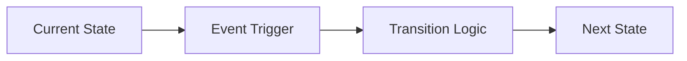

## 🏗️ Model & Template Structure

A template for `idae-machine` must define collections, fields, and relationships. Here is a minimal example:

```typescript
// Example schemeModel for Machine
export const schemeModel = {
  agents: {
    keyPath: 'id',
    ts: {} as Agent, // Optional typing for autocompletion
    template: {
      index: 'id',
      presentation: 'name',
      fields: {
        id: 'id (readonly)',
        name: 'text (required)',
        active: 'boolean',
        created_at: 'date'
      },
      fks: {
        group: { code: 'group', multiple: false, rules: '' }
      }
    }
  },
  groups: {
    keyPath: 'id',
    ts: {} as Group,
    template: {
      index: 'id',
      presentation: 'label',
      fields: {
        id: 'id (readonly)',
        label: 'text (required)'
      }
    }
  }
};
```

## 🔍 Query Examples (via Machine)

After instantiating and starting Machine:

```typescript
import { machine, schemeModel } from '@medyll/idae-machine';

// Singleton initialization
machine.init({ dbName: 'my-db', version: 1, model: schemeModel });
machine.start();


// Add an agent
await machine.idbql.agents.add({ name: 'Alice', active: true });

// Simple query
const activeAgents = await machine.idbql.agents.where({ active: true }).toArray();

// Update
await machine.idbql.agents.put({ id: 1, name: 'Alice Cooper', active: true });

// Delete
await machine.idbql.agents.delete(1);

// Multi-collection transaction
const result = await machine.idbql.transaction([
  'agents', 'groups'
], 'readwrite', async (tx) => {
  const agentStore = tx.objectStore('agents');
  const groupStore = tx.objectStore('groups');
  const groupId = await groupStore.add({ label: 'Admins' });
  const agentId = await agentStore.add({ name: 'Bob', active: true, group: groupId });
  return { groupId, agentId };
});
```
## ⚡ Advanced Data & Reactivity

`idae-machine` leverages the power of [@medyll/idae-idbql](https://github.com/medyll/idae-idbql) to provide:
- A MongoDB-inspired IndexedDB query engine
- Complex multi-collection transactions
- Svelte 5 reactive state (`idbqlState`) for real-time UIs
- Migration and versioning management
- Robustness and advanced error handling

### Svelte 5: Reactive State

Use `store` for reactive lists or views:

```svelte
<script lang="ts">
  import { machine } from './store'; // or create your own instance
  // Reactive list of active agents
  const activeAgents = $derived(() => machine.idbqlState.agents.where({ active: true }));
</script>

<h2>Active agents</h2>
{#each $activeAgents as agent}
  <p>{agent.name}</p>
{/each}
```


# @medyll/idae-machine

**Low-code UI framework** for rapid data structure visualization and CRUD operations in Svelte 5. Declare your database schema once, automatically generate rich UI components for displaying, creating, and updating structured data in IndexedDB.

## 🎯 Purpose

`idae-machine` bridges the gap between **data modeling** (`@medyll/idae-idbql`) and **rich UI components** (`@medyll/idae-slotui-svelte`). It provides:
- **Schema-driven UI generation**: Declare your data model, get form components for free
- **CRUD Zone**: Pre-built "Create-Read-Update-Delete" interface for any collection
- **Relational support**: Foreign key and reverse foreign key visualization
- **In-place editing**: Edit records inline without modal dialogs
- **Field-level validation**: Type-safe field rules (required, readonly, private)

## 📦 Core Architecture

### Layer Stack

```
UI Components (Svelte 5 Components)
    ↓
Form Management & Validation Logic
    ↓
Database Schema Definition (TypeScript Types)
    ↓
IndexedDB Abstraction (@medyll/idae-idbql)
```

### Key Modules

| Module | Purpose |


## 🚀 Quick Start: App Initialization

The recommended way to initialize your app is to use the `Machine` class, which centralizes schema, collections, and IndexedDB access.


```typescript
import { machine, schemeModel } from '@medyll/idae-machine';

// Singleton initialization
machine.init({ dbName: 'my-db', version: 1, model: schemeModel });
machine.start();

// Access collections, db, and model
const collections = machine.collections;
const idbql = machine.idbql;
const idbqlState = machine.idbqlState;
const db = machine.indexedb;
const model = machine.idbqModel;
```

You can now pass `collections` and other instances to Svelte components for CRUD, data listing, and editing.

### Legacy/Direct Usage (not recommended)
You can still use `createIdbqDb` directly if you need low-level access:

```typescript
import { createIdbqDb, type IdbqModel } from '@medyll/idae-idbql';
const idbqlState = createIdbqDb(schemeModel);
```

### 2. Use CRUD Components

```svelte
<script lang="ts">
  import { CrudZone, CreateUpdate, DataList } from '@medyll/idae-machine';
</script>

<!-- Full CRUD interface -->
<CrudZone collection="agents" />

<!-- Or compose individually -->
<DataList collection="agents" />
<CreateUpdate collection="agents" mode="create" />
```

## 📋 Component Guide

### `<CrudZone>`
Unified CRUD interface with sidebar list and detail editing.
```svelte
<CrudZone collection="agents" style="height: 600px; min-width: 750px" />
```

### `<DataList>`
Displays collection records as grid with click-to-edit.
```svelte
<DataList 
  collection="agents"
  displayMode="grid"
  where={{ active: { $eq: true } }}
  onclick={(data, idx) => console.log(data)}
/>
```
  mode="show"
  dataId={1}
  showFields={['name', 'code', 'model']}
  inPlaceEdit={true}
  showFks={true}
/>
```
```svelte
  collection="agents"
  fieldName="name"
  data={formData}
  mode="edit"
  editInPlace={true}
/>
```

### Relational Components
```svelte
<!-- Foreign Keys (refs TO other collections) -->
<CollectionFks collection="agents" />

<!-- Reverse Foreign Keys (records pointing TO this one) -->
<CollectionReverseFks collection="agents">
  {#snippet children({ collection, template })}
    <div>{collection} references this agent</div>
  {/snippet}
</CollectionReverseFks>
```

## 🔧 Schema Definition (dbFields.ts)

Field types are declared using a string-based DSL:

```typescript
fields: {
  // Primitives
  id: 'id (readonly)',
  name: 'text (required)',
  age: 'number',
  active: 'boolean',
  email: 'email',
  created: 'date',
  
  // Text variants
  bio: 'text-long',
  note: 'text-area',
  
  // Relations
  categoryId: 'fk-category.id (required)',
  
  // Collections
  tagIds: 'array-of-number',
  
  // Modifiers
  password: 'password (private)',
  system_field: 'text (readonly private)'
}
```


## 🛡️ Robustness, Coverage & Performance

All core logic (`dbFields.ts`, `machine.ts`, etc.) is tested and optimized:
- **Schema parsing**: all types and modifiers are handled
- **Relations**: typed and tested FK and reverse-FK
- **Unit tests**: every exported method is covered (Vitest)
- **Svelte 5**: strict convention compliance
- **Error handling**: typed exceptions, transactional robustness
- **Performance**: indexes, optimized queries, built-in tips

### Current Focus
- ✅ Schema declaration & typing
- ✅ Advanced IndexedDB integration
- ✅ Component export & modular structure
- ✅ Exhaustive test coverage
- ✅ Svelte 5 policy
- 🔄 Form validation (in progress)
- 🔄 Field rendering pipeline
- ⏳ End-to-end CRUD workflows

## 🧪 Testing Policy

All logic in `dbFields.ts` and related modules is covered by unit tests:

- **Test schema**: All tests use a realistic, complex schema (see `testDbSchema.ts`).
- **Coverage**: Every method of every exported class is tested, including edge cases (array/object/fk/required/readonly).
- **Continuous validation**: All tests must pass before merge. See `CHANGELOG.md` for test and coverage history.


## 🦄 Svelte 5 Coding Policy

All UI code must strictly follow Svelte 5 syntax and conventions. See `AGENTS.md` for details and migration rules.

## 📖 Developer & Documentation Policy

- All classes and methods in the codebase are fully documented with jsDoc, including `@role`, `@param`, and `@return` in English.
- Internal imports use `$lib` alias for consistency and maintainability.
- All code is strictly compliant with Svelte 5 standards (see `AGENTS.md`).
- Pull requests must respect documentation and Svelte 5 rules, or will be rejected.

### Example jsDoc
```typescript
/**
 * @class MachineDb
 * @role Central class for parsing, introspecting, and extracting metadata from the database schema.
 * @param {IdbqModel} model Custom model to use.
 */
```

See source files for full jsDoc coverage.

## 🔗 Dependencies

- **@medyll/idae-idbql**: IndexedDB abstraction with schema support
- **@medyll/idae-slotui-svelte**: UI component library (Button, MenuList, Looper, etc.)
- **svelte**: ^5.0.0 (uses Svelte 5 runes)
### Build
```bash
### Development Server
```bash
npm run dev          # Start dev server on localhost
npm run dev -- --open  # Auto-open in browser
```

### Quality Assurance
```bash
npm run check        # Svelte type checking
npm run lint         # ESLint + Prettier check
npm run format       # Auto-format code
npm run test:unit    # Run Vitest unit tests
npm run test         # Single-run test mode
```

## 📚 Code Structure

```
src/lib/
├── db/                    # Schema & field layers
│   ├── dbSchema.ts       # Collection templates
│   ├── dbFields.ts       # Field rules & validation
│   └── dataModel.ts      # TypeScript types
│   ├── CollectionFks.svelte      # Forward relations
│   ├── CollectionReverseFks.svelte # Back-references
│   └── ...
└── index.ts             # Main exports
```

## 🎓 Example Projects

See `src/routes/` for a working showcase of all components in action.

## 📄 License

MIT - See LICENSE file

---

**Next Steps for Contributors:**
1. Stabilize form validation pipeline
2. Add comprehensive test suite
3. Document TypeScript schema inference
4. Create migration guides from legacy code in `src/_old/`


## Architecture


