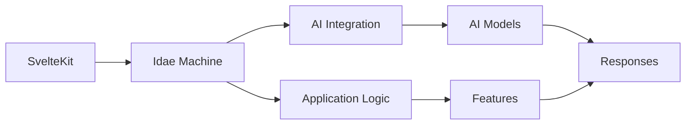

# idae-machine

SvelteKit based framework to build AI powered applications with ease.

## Architecture


```mermaid
graph LR
    A[SvelteKit] --> B[Idae Machine]
    B --> C[AI Integration]
    B --> D[Application Logic]
    C --> E[AI Models]
    D --> F[Features]
    E --> G[Responses]
    F --> G
```

## Features

- SvelteKit integration
- AI model support
- Prompt management
- Easy deployment
- Type-safe

## Installation

```bash
npm install @medyll/idae-machine
pnpm add @medyll/idae-machine
```

## Documentation

For more information, visit the [main documentation](../../README.md)

## License

MIT
