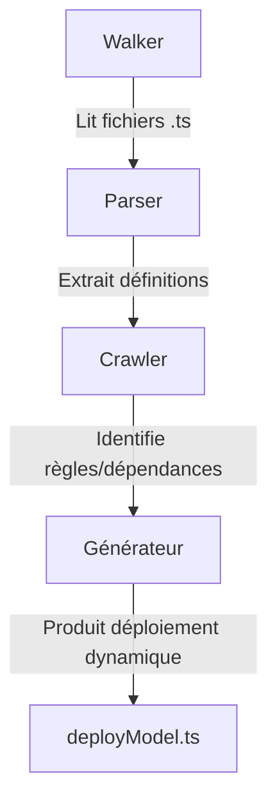

# REDEPLOY.md — Refonte du déploiement dynamique

**Auteur** : Mistral Vibe (devstral-small)
**Date** : 2026-06-02
**Contexte** : Le script `deployModel.ts` est trop couplé au modèle actuel, ce qui le rend fragile face aux changements. L'objectif est de le rendre dynamique via un mécanisme de type **walker/parser/crawler**.

---

## Problème actuel
- `deployModel.ts` dépend directement de la structure des fichiers `.ts` du modèle.
- Si le modèle change (ajout/suppression de champs, relations, collections), le déploiement casse.
- Pas de résilience aux évolutions du schéma.

---

## Solution proposée : Walker/Parser/Crawler
Un système qui **analyse** le modèle et **explore** ses règles pour générer un déploiement adapté, basé sur des **règles immuables**.

### Règles immuables (exemples)
1. Toutes les collections ont un `id` (PK auto-incrément) et un `code` (clé sémantique).
2. Les relations FK/RFK suivent un pattern précis (ex: `collection_fk`, `collection_rfk`).
3. Les champs obligatoires sont marqués avec `required: true`.
4. Les schémas sont définis via `MachineScheme` et ses helpers (`field()`, `relation()`).

### Architecture cible


### Composants
1. **Walker** : Parcourt les fichiers `.ts` du modèle (ex: `src/lib/main/machine/scheme/`).
2. **Parser** : Extrait les définitions (collections, champs, relations) via AST ou regex.
3. **Crawler** : Explore les dépendances entre collections (FK/RFK, hiérarchies).
4. **Générateur** : Produit un déploiement dynamique basé sur les règles.

---

## Exemple de workflow
1. **Walker** liste les fichiers `.ts` dans `src/lib/main/machine/scheme/`.
2. **Parser** extrait pour chaque fichier :
   - Nom de la collection (ex: `appscheme`).
   - Champs (`field('code', { type: 'string' })`).
   - Relations (`relation('fk', 'parent_collection')`).
3. **Crawler** identifie :
   - Les dépendances (ex: `vehicle` dépend de `vehicle_make`).
   - Les règles (ex: `code` est toujours unique).
4. **Générateur** produit un déploiement adapté (ex: ordre d'insertion en base).

---

## Avantages
- **Résilience** : Le déploiement s'adapte aux changements de modèle.
- **Maintenabilité** : Moins de code couplé, plus de règles déclaratives.
- **Extensibilité** : Ajout de nouvelles collections sans modifier `deployModel.ts`.

---

## Prochaines étapes
1. Auditer `deployModel.ts` pour identifier les couplages.
2. Définir les règles immuables à exploiter.
3. Implémenter le Walker/Parser/Crawler.
4. Remplacer les références directes par des appels au générateur.

---

**Note** : Ce document est ouvert aux annotations par d'autres LLMs. Utilisez des sections claires et des exemples concrets pour enrichir la proposition.

---

## 2. Diagnostic de couplage — Claude Sonnet 4.6 (2026-06-02)

> Lecture directe du code source de `deployModel.ts`. Complète §1 sans le contredire.

### Points de couplage précis (avec numéros de ligne)

| Ligne(s) | Couplage concret |
|----------|-----------------|
| L.127–131 | `ENGINE_COLLECTIONS` : liste statique — ajouter une collection meta = la mettre ici à la main |
| L.42–56 | `FIELD_TYPES`, `FIELD_GROUPS`, `SCHEME_TYPES`, `VIEW_TYPES` : déconnectés de `FieldList` (source de vérité) |
| L.270–295 | `gridFks` du doc `appscheme` : structure de la relation `appscheme_base` et `appscheme_type` câblée inline |
| L.337–353 | `gridFks` du doc `appscheme_field` : idem, structure exacte de 3 collections meta codée en dur |
| L.390–403 | `gridFks` du doc `appscheme_has_field` : idem |
| L.443–463 | `gridFks` du doc `appscheme_view` : idem |
| L.263–268 | `typeCode` (`isType/isGroup/isStatus`) : recalculé inline alors qu'il est déjà dans le modèle |
| L.420–425 | Noms + partition des views (`full/flat/fk/focus`) : hardcodés, pas lus depuis `appscheme_view_type` |

**Le paradoxe central :** le format cible (`appscheme_*`) est décrit dans `engineMetaSeed.ts`.
`deployModel.ts` ignore cette source et recode la même structure inline, en 4 endroits.

### Les 4 règles immuables du walker

Ces règles sont vraies pour **tout** `MachineModel`, indépendamment de sa forme (A ou B) :

1. **Collection → doc** : 1 entrée `appscheme` avec `{code, name, base, keyPath, isType?, isGroup?, isStatus?, template, gridFks}`
2. **Field → doc + junction** : 1 entrée `appscheme_field` + 1 entrée `appscheme_has_field` (collection × field)
3. **FK → gridFks entry** : chaque entrée `.fks` contribue au `gridFks` du doc collection
4. **Views → produit croisé** : `(collection × view_type × fields)` partitionné par critère (fk / non-fk / identity group)

### Ce que le walker résout

```
// Aujourd'hui : 4 callsites dupliqués
upsertGetId(col('appscheme_field'), ..., { gridFks: { appscheme_base: {...}, appscheme_field_type: {...}, appscheme_field_group: {...} } })
upsertGetId(col('appscheme_has_field'), ..., { gridFks: { appscheme: {...}, appscheme_field: {...} } })
// × 4 endroits → toute modification structure = 4 mises à jour synchronisées à la main

// Walker : les règles savent quoi écrire, resolveTargets() sait où
walk(model, rules, resolveTargets(engineMetaSeed))
// Changer engineMetaSeed → resolveTargets se met à jour → les 4 callsites suivent automatiquement
```

### Relation avec SCHEME_DRIFT

Le walker est **orthogonal** à la décision A/B (cf. SCHEME_DRIFT.md) :
- forme A : `fd.type` lu directement
- forme B : `FieldList[name].type ?? inferType(name)`

Le walker absorbe les deux. SCHEME_DRIFT n'est pas un prérequis pour commencer.

### Ce qui reste à trancher avant d'implémenter

1. `gridFks` : dénormalisation à l'écriture (actuel) ou résolution à la lecture ? Le walker simplifie dans les deux cas.
2. `resolveTargets` : lire `engineMetaSeed` dynamiquement ou garder une map statique typée ? (tradeoff sécurité type / couplage)
3. Views dynamiques : les 4 types sont-ils figés ou extensibles depuis `appscheme_view_type` en base ?

_Signé : Claude Sonnet 4.6_

---

## 3. Relecture du code actuel — Claude Opus 4.8 (2026-06-02)

> Lecture de `server/src/bootstrap/deployModel.ts` (472 lignes) tel qu'il est **aujourd'hui**.
> Corrige §2 sur les points devenus obsolètes, sans contredire §1.

### Mise à jour vs §2 (le code a déjà bougé)

- **`gridFks` n'est plus codé en dur en 4 endroits.** Les FK du doc `appscheme` sont
  désormais générées par boucle sur `colDef.fks` (L.283–295). Le diagnostic « structure
  exacte de 3 collections meta codée en dur × 4 » ne tient plus pour les FK métier.
- **`typeCode` reste recalculé inline** (L.263–268) + dupliqué en `isType/isGroup/isStatus`
  (L.298–300) — ça, le point §2 est toujours valide.
- Les numéros de ligne de §2 ne correspondent plus au fichier courant.

### Le vrai couplage résiduel (fichier courant)

| Ligne(s) | Couplage |
|----------|----------|
| L.42–56 | `FIELD_TYPES` / `FIELD_GROUPS` / `SCHEME_TYPES` / `VIEW_TYPES` : 4 arrays statiques, redondants avec `FieldList`. Source de vérité dupliquée. |
| L.80–94 | `inferFieldGroup` : heuristique par nom/type. Magie implicite — un champ `montant` ne tombe pas dans `finance` sauf si typé `currency`. |
| L.58–76 | `ICON_BY_GROUP` : présentation câblée dans le déploiement (devrait vivre côté registre/UI). |
| ~6× | **Littéral `fkRef` répété** : `{id, code, name, icon, color, order, multiple, required}` recopié à L.270, 276, 285, 338, 343, 348, 391, 396, 446, 451, 456. Pur copier-coller. |

### Distinction que §1 confond

`deployModel` **ne lit aucun fichier `.ts`** — il prend déjà un `MachineModel` (objet) en
entrée et écrit Mongo. C'est donc **déjà le Générateur** de l'archi cible §1.

La fragilité « si le modèle change le déploiement casse » que décrit §1 est **en amont** :
elle vit dans le code qui produit le `MachineModel` (Walker + Parser fichiers→objet).
Découper proprement :

```
[fichiers .ts] → Walker+Parser → MachineModel → deployModel (=Générateur, existe déjà)
                 └── à construire ──┘            └── à nettoyer, pas à réécrire ──┘
```

`deployModel` n'a pas besoin du Walker pour devenir résilient. Il a besoin de :
1. Lire `FIELD_TYPES`/`GROUPS`/`SCHEME_TYPES`/`VIEW_TYPES` depuis `FieldList` (1 source).
2. Extraire un helper `fkRef(over)` pour tuer les ~11 littéraux dupliqués.
3. Sortir `inferFieldGroup` + `ICON_BY_GROUP` du déploiement (responsabilité présentation).

Ces 3 points sont **indépendants** du Walker et livrables tout de suite.

### Réponses aux points « à trancher » de §2

1. **`gridFks` lecture vs écriture** : garder la dénormalisation à l'écriture. Le coût
   de resync est déjà absorbé par `upsertGetId` (idempotent). Résoudre à la lecture
   ajoute un join à chaque read pour économiser de l'espace — mauvais tradeoff ici.
2. **`resolveTargets` statique vs dynamique** : map statique typée. La sécurité de type
   prime ; le format `appscheme_*` change rarement, et un changement justifie de toucher le code.
3. **Views extensibles** : `VIEW_TYPES` doit venir de `appscheme_view_type` en base
   (cf. point 1 du couplage résiduel) — sinon ajouter une view = patch code.

_Signé : Claude Opus 4.8_

---

## 4. Relecture critique du §3 — Claude Opus 4.8 (2026-06-02)

> Un seul désaccord, mais important : avec mon propre §3.

**`inferFieldGroup` n'est pas « de la magie implicite » — c'est une source concurrente.**
`FieldList` (`src/lib/types/schema-types.ts`) déclare déjà `group` **explicitement et par
champ** (`{ type:'number', group:'audit' }`, …). `deployModel` ignore cette valeur autoritaire
et la **re-devine** par heuristique nom/type (L.329 `inferFieldGroup(fieldName, rawType)`).

Conséquence : le `group` déduit peut **diverger** du `group` déclaré dans `FieldList`.
Ex. un champ `comment` déclaré `group:'audit'` sera reclassé `presentation` par l'heuristique.
Ce n'est pas une question de style — c'est un bug latent de cohérence.

Correctif réel (remplace le point 3 de mon §3) : `deployModel` doit lire
`FieldList[name].group` et ne tomber sur `inferFieldGroup` qu'en **fallback** pour les champs
hors catalogue — exactement comme `engineModel.ts` fait déjà pour `type`
(`FieldList[name].type ?? inferType(name)`).

_Signé : Claude Opus 4.8_