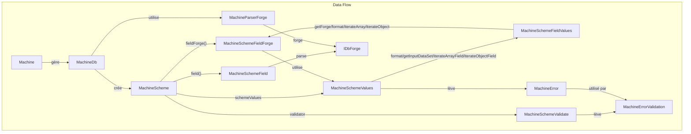

# Architecture de la machine (2026)

Diagramme à jour de l'architecture du cœur d'idae-machine, aligné sur le code réel et les conventions :

## Points clés mis à jour
- **Machine** : point d’entrée principal, gère la base, le schéma, expose les accès aux collections, à l’état et à IndexedDB.
- **MachineDb** : logique centrale du schéma, crée/gère les collections, utilise `MachineParserForge` pour parser les champs.
- **MachineScheme** : représente une collection (table), expose les forges de champs, les valeurs, la validation. Méthodes clés : `field(fieldName)`, `fieldForge(fieldName, data)`, `parse()`.
- **MachineSchemeField** : gère le parsing et les métadonnées d’un champ. `parse()` retourne un `IDbForge`.
- **MachineSchemeFieldForge** : fournit des métadonnées avancées/formatage pour un champ, selon un objet data.
- **MachineSchemeValues** : formatage/préparation des données de collection, helpers pour valeurs de champ.
- **MachineSchemeFieldValues** : introspection/formatage d’une valeur de champ, délègue à `MachineSchemeFieldForge`.
- **MachineSchemeValidate** : validation des champs de formulaire, lève `MachineErrorValidation` en cas d’erreur.
- **MachineError** : erreur personnalisée pour la logique de collection, utilisée dans les valeurs/validations.
- **MachineErrorValidation** : erreur personnalisée pour la validation.
- **MachineParserForge** : utilitaire pour parser les règles de champ et générer les métadonnées.
- **IDbForge** : structure retournée par le parsing de champ, utilisée pour la métadonnée et la logique UI.

> Pour plus de détails, voir le README et la jsDoc dans chaque fichier.
