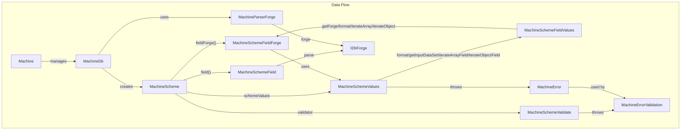

# Machine Architecture (2026)

Below is the up-to-date architecture for the idae-machine core, reflecting the latest class names and relationships:

## Key Points
- **Machine**: Main entry point, manages the database, schema, and exposes accessors for collections, state, and the underlying IndexedDB.
- **MachineDb**: Central schema logic, creates and manages collections, uses `MachineParserForge` for field parsing.
- **MachineScheme**: Represents a collection (table), provides access to field forges, values, and validation. Key methods: `field(fieldName)`, `fieldForge(fieldName, data)`, `parse()`, etc.
- **MachineSchemeField**: Handles parsing and metadata for a single field. Method: `parse()` returns an `IDbForge`.
- **MachineSchemeFieldForge**: Provides advanced metadata and formatting for a single field, given a data object.
- **MachineSchemeValues**: Handles formatting and presentation of collection data, and provides helpers for field values.
- **MachineSchemeFieldValues**: Introspects and formats individual field values, and delegates to `MachineSchemeFieldForge` for metadata.
- **MachineSchemeValidate**: Validates form fields, throws `MachineErrorValidation` on error.
- **MachineError**: Custom error for collection logic, used for error handling in values and validation.
- **MachineErrorValidation**: Custom error for validation logic.
- **MachineParserForge**: Utility for parsing field rules and generating field metadata.
- **IDbForge**: Structure returned by field parsing, used for metadata and UI logic.

> See the README and jsDoc in each file for more details on each class and their methods.
