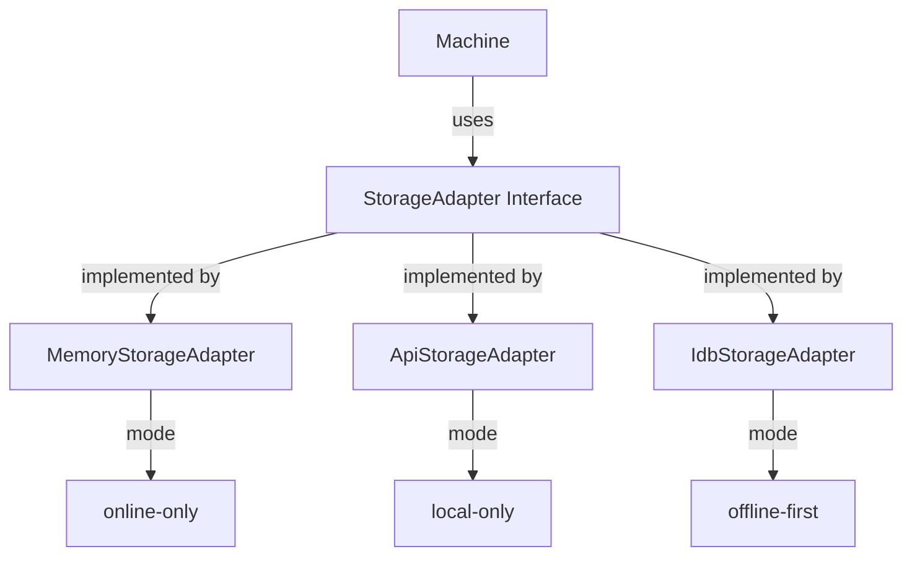

# Qoolie Multi-Mode Storage Adapters

This module implements the storage adapter architecture for Qoolie's multi-mode support as described in `QOOLIE_NEXT.md`.

## Overview

The storage adapter architecture enables Qoolie to support multiple operating modes:

- **Online-only**: API-driven with memory cache
- **Local-only**: IndexedDB-only with full offline support  
- **Offline-first**: IndexedDB with sync to server (existing behavior)

## Architecture



## Storage Adapter Interface

All storage adapters implement the `StorageAdapter<T>` interface:

```typescript
interface StorageAdapter<T> {
  create(data: Omit<T, 'id'> & { id?: string }): Promise<T>;
  update(id: string, data: Partial<T>): Promise<T>;
  delete(id: string): Promise<boolean>;
  get(id: string): Promise<T | undefined>;
  getAll(): T[];
  where(query: Record<string, any>): T[];
  on(event: string, listener: (data: any) => void): void;
  off(event: string, listener: (data: any) => void): void;
  getMode(): string;
}
```

## Available Adapters

### MemoryStorageAdapter

**Mode**: `memory`

In-memory storage with event system. Used for:
- Testing
- Temporary data
- Online-only mode caching

**Features**:
- ✅ Full CRUD operations
- ✅ Query support with operators (`$gt`, `$lt`, `$in`, etc.)
- ✅ Event system (`create`, `update`, `delete`, `change`)
- ✅ Synchronous `getAll()` and `where()` methods
- ❌ No persistence (cleared on page reload)

**Example**:
```typescript
import { MemoryStorageAdapter } from '$lib/storage/MemoryStorageAdapter.js';

interface User {
  id: string;
  name: string;
  age: number;
}

const storage = new MemoryStorageAdapter<User>();

// Create
const user = await storage.create({ name: 'Alice', age: 25 });

// Query
const adults = storage.where({ age: { $gte: 18 } });

// Events
storage.on('create', (data) => console.log('Created:', data));
```

### ApiStorageAdapter

**Mode**: `online-only`

API-backed storage with local memory cache. Used for:
- Online-only applications
- Real-time data synchronization
- Server-centric architectures

**Features**:
- ✅ API-based CRUD operations
- ✅ Local memory cache for performance
- ✅ Event system for reactivity
- ✅ Cache invalidation
- ❌ Requires network connectivity

**Example**:
```typescript
import { ApiStorageAdapter } from '$lib/storage/ApiStorageAdapter.js';

const apiClient = {
  get: async (collection, id) => fetch(`/api/${collection}/${id}`).then(r => r.json()),
  create: async (collection, data) => fetch(`/api/${collection}`, { 
    method: 'POST', 
    body: JSON.stringify(data) 
  }).then(r => r.json()),
  // ... implement other methods
};

const storage = new ApiStorageAdapter(apiClient, 'users');

const user = await storage.create({ name: 'Bob', email: 'bob@example.com' });
```

### IdbStorageAdapter

**Mode**: `indexeddb`

IndexedDB storage wrapper. Used for:
- Local-only applications
- Offline-first applications (when combined with sync)
- Persistent client-side storage

**Status**: Partial implementation - requires integration with existing Qoolie instance

## Query Operators

The `where()` method supports MongoDB-style query operators:

| Operator | Example | Description |
|----------|---------|-------------|
| `$eq` | `{ age: { $eq: 25 } }` | Equal to |
| `$ne` | `{ age: { $ne: 25 } }` | Not equal to |
| `$gt` | `{ age: { $gt: 18 } }` | Greater than |
| `$gte` | `{ age: { $gte: 18 } }` | Greater than or equal |
| `$lt` | `{ age: { $lt: 30 } }` | Less than |
| `$lte` | `{ age: { $lte: 30 } }` | Less than or equal |
| `$in` | `{ status: { $in: ['active', 'pending'] } }` | Value in array |
| `$nin` | `{ status: { $nin: ['inactive'] } }` | Value not in array |
| `$like` | `{ name: { $like: '%ohn%' } }` | SQL-like pattern matching |
| `$regex` | `{ name: { $regex: /^John/i } }` | Regular expression |

## Event System

All adapters support an event system for reactivity:

```typescript
storage.on('create', (record) => {
  console.log('New record created:', record);
});

storage.on('update', (record) => {
  console.log('Record updated:', record);
});

storage.on('delete', ({ id }) => {
  console.log('Record deleted:', id);
});

storage.on('change', () => {
  console.log('Data changed - refresh UI');
});

// Unsubscribe
storage.off('create', listener);
```

## Integration with Machine

The storage adapters are designed to be integrated into the Machine class. Future work includes:

1. **Mode Detection**: Automatic selection based on configuration
2. **Adapter Injection**: Machine will use the appropriate adapter
3. **Fallback Strategies**: Graceful degradation between modes
4. **Sync Integration**: Connecting API adapter with sync controller

## Development Status

| Component | Status | Notes |
|-----------|--------|-------|
| StorageAdapter Interface | ✅ Complete | Type-safe interface definition |
| MemoryStorageAdapter | ✅ Complete | Fully functional with tests |
| ApiStorageAdapter | ✅ Complete | Basic implementation with tests |
| IdbStorageAdapter | ⚠️ Partial | Needs Qoolie integration |
| Machine Integration | 🚧 Planned | Next phase of development |
| Server Hooks | 🚧 Planned | DB → WebSocket broadcasting |

## Testing

Run storage adapter tests:

```bash
pnpm run test src/lib/storage/__tests__/storage-adapters.test.ts
```

Run demo tests:

```bash
pnpm run test src/lib/storage/demo/storage-demo.test.ts
```

## Type Safety

All adapters are fully typed with TypeScript and pass `svelte-check` validation.

## Future Work

1. **Complete IdbStorageAdapter**: Full integration with Qoolie
2. **Machine Integration**: Mode detection and adapter selection
3. **QoolieNext Wrapper**: Backward-compatible API layer
4. **Server Hooks**: Real-time event broadcasting
5. **Performance Optimization**: Cache strategies, batching
6. **Conflict Resolution**: Multi-mode sync strategies

## License

MIT © Medyll

See `QOOLIE_NEXT.md` for full architecture documentation and roadmap.