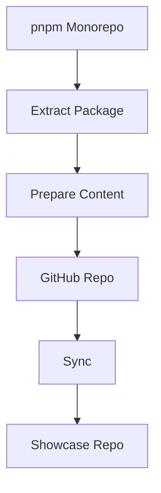

# idae-mono-expand-vitrine

Sync pnpm monorepo packages to individual GitHub showcase repositories.

## Architecture



## Features

- Package extraction
- GitHub sync
- Monorepo management
- Automatic updates
- Repo showcase

## Installation

```bash
npm install @medyll/idae-mono-expand-vitrine
pnpm add @medyll/idae-mono-expand-vitrine
```

## Documentation

For more information, visit the [main documentation](../../README.md)

## License

MIT
