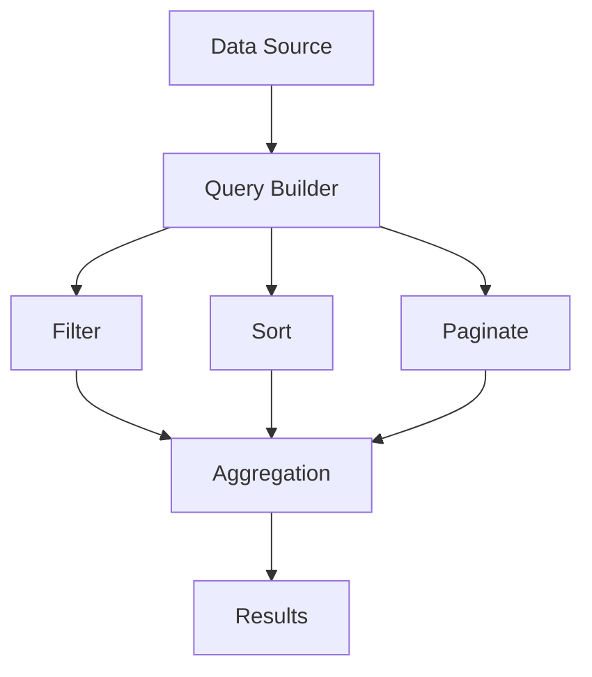

# idae-query

A powerful query library with MongoDB-like interface, TypeScript support, and front-end framework integration.

## Architecture



## Features

- MongoDB-like syntax
- TypeScript support
- Composable queries
- Framework agnostic
- Performance optimized

## Installation

```bash
npm install @medyll/idae-query
pnpm add @medyll/idae-query
```

## Documentation

For more information, visit the [main documentation](../../README.md)

## License

MIT
