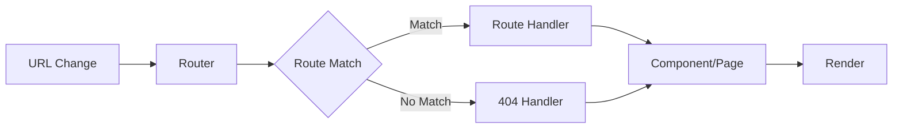

# idae-router

Routing library for managing application navigation and routes.

## Architecture



## Features

- Dynamic routing
- Middleware support
- Route matching
- Navigation guards
- History management

## Installation

```bash
npm install @medyll/idae-router
pnpm add @medyll/idae-router
```

## Documentation

For more information, visit the [main documentation](../../README.md)

## License

MIT
