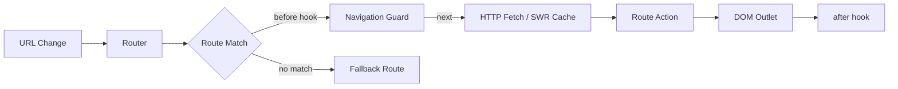

# idae-router

A lightweight, framework-agnostic client-side router for single-page applications. It provides path parameters, query parsing, lifecycle hooks, declarative HTTP data fetching, an in-memory SWR cache, and full TypeScript generics.

## Table of contents

1. [Quick start](#quick-start)
2. [Core concepts](#core-concepts)
3. [Basic examples](#basic-examples)
4. [HTTP data fetching](#http-data-fetching)
5. [TypeScript and generics](#typescript-and-generics)
6. [SWR cache and prefetching](#swr-cache-and-prefetching)
7. [Router API reference](#router-api-reference)
8. [Nested routes and outlets](#nested-routes-and-outlets)
9. [Advanced patterns](#advanced-patterns)
10. [Development and publishing](#development-and-publishing)
11. [Testing](#testing)
12. [Contributing](#contributing)
13. [Troubleshooting](#troubleshooting)


---

## Architecture



## Core concepts

**Route action**
A function invoked when a route matches. It may return:
- `string` — HTML placed into the outlet
- `Node` or `DocumentFragment` — inserted into the outlet
- `void` — side-effect-only route, keeps previous DOM
- a cleanup function — called when leaving the route

**Context**
The object passed to actions and hooks. It contains:
- `params` — path parameters extracted from the URL
- `query` — parsed query string
- `data` — response payload from an HTTP fetch (if configured)
- `isLoading`, `isRevalidating`, `queryError` — fetch state flags

**Hooks**
- `before(to, from, next)` — navigation guard; call `next()`, `next(path)`, or `next(false)`
- `after(to)` — notification fired after navigation completes
- `onLeave(from)` — notification fired when leaving a route

**HTTP sources**
Declarative `http` or `http_source` configuration on a route. The router interpolates `:param` tokens and populates `ctx.data` before calling the action.

**SWR cache**
In-memory cache with TTL and background revalidation (stale-while-revalidate pattern).

---

## Basic examples

### Minimal router

```ts
import { createRouter } from 'idae-router';

const routes = [
  { path: '/', action: () => '<h1>Home</h1>' },
  { path: '/about', action: () => '<h1>About</h1>' }
];

const router = createRouter({ routes, outlet: '#app' });
```

### Route with params and cleanup

```ts
const routes = [{
  path: '/user/:id',
  action: (ctx) => {
    const el = document.createElement('div');
    el.textContent = `User ${ctx.params.id}`;
    const timer = setInterval(() => { /* polling */ }, 1000);
    return () => clearInterval(timer); // called on leave
  }
}];

const router = createRouter({ routes, outlet: '#app', linkInterception: true });
router.push('/user/1');
```

### Navigation guards

```ts
router.before((to, from, next) => {
  if (!isAuthenticated()) {
    next('/login');
  } else {
    next();
  }
});
```

---

## HTTP data fetching

Define an `http` property on a route. The router interpolates `:param` tokens, fetches the URL, and attaches the parsed response to `ctx.data` before invoking the action.

```ts
{
  path: '/users/:id',
  http: { url: '/api/users/:id' },
  action: (ctx) => {
    if (ctx.isLoading) return '<p>Loading...</p>';
    if (ctx.queryError) return `<p>Error: ${ctx.queryError.message}</p>`;
    return `<h1>${ctx.data?.name}</h1>`;
  }
}
```

**Fetcher context fields**

| Field | Type | Description |
|---|---|---|
| `ctx.data` | `TData \| null` | Parsed JSON response body |
| `ctx.isLoading` | `boolean` | True while initial fetch is in-flight |
| `ctx.isRevalidating` | `boolean` | True during background revalidation |
| `ctx.queryError` | `Error \| undefined` | Set when fetch fails or response is not ok |

`http_source` behaves identically to `http` but is consumed with lower priority, making it suitable as a secondary or fallback data provider.

---

## TypeScript and generics

All core types accept a `TData` generic so `ctx.data` is strongly typed end-to-end.

```ts
import type { Route, Action } from 'idae-router';

interface Post { id: number; title: string; }

const postAction: Action<Post> = (ctx) => `<h1>${ctx.data?.title}</h1>`;

const routes: Route<Post>[] = [{
  path: '/posts/:id',
  http: { url: '/api/posts/:id' },
  action: postAction
}];
```

When `TData` is omitted it defaults to `unknown`, which is safe and backward-compatible.

---

## SWR cache and prefetching

Enable caching by passing a `cache` option to `createRouter`:

```ts
const router = createRouter({
  routes,
  outlet: '#app',
  cache: { ttl: 60_000, staleTime: 5_000 }
});
```

| Option | Description |
|---|---|
| `ttl` | Entry lifetime before eviction (ms) |
| `staleTime` | Serve from cache and revalidate in background (ms) |

**Automatic prefetching**

When both `cache` and `linkInterception` are enabled, hovering an anchor element for 200 ms triggers a prefetch. The request is cancelled if the pointer leaves before the debounce expires.

**Programmatic cache control**

```ts
// Warm the cache for a given path
await router.prefetch('/dashboard');

// Evict a specific entry
router.invalidate('/api/users/42');

// Clear the entire cache
router.invalidate();
```

Patterns passed to `invalidate` support glob-like suffixes (e.g., `/api/users/*`).

---

## Router API reference

| Method | Signature | Description |
|---|---|---|
| `push` | `(path: string) => void` | Navigate and push to history |
| `replace` | `(path: string) => void` | Navigate without pushing |
| `refresh` | `() => void` | Re-run the current route (re-fetches if needed) |
| `before` | `(guard) => void` | Register a before-navigation guard |
| `after` | `(hook) => void` | Register an after-navigation hook |
| `onLeave` | `(hook) => void` | Register a leave hook |
| `prefetch` | `(path: string) => Promise<void>` | Warm the cache |
| `invalidate` | `(pattern?: string) => void` | Clear cache entries |
| `buildUrl` | `(path, params?) => string` | Interpolate URL tokens |
| `getState` | `() => Context \| null` | Return the current navigation context |

---

## Nested routes and outlets

Routes may declare `children`. When a chain matches:
- `Context.matched` exposes the full ancestor-to-leaf list.
- Params from the ancestor chain are merged into `Context.params`.
- Parent actions mount first; child actions mount into the parent's `data-idae-outlet` element when present.

```ts
{
  path: '/blog/:blogId',
  action: (ctx) =>
    `<section>
      <h1>Blog ${ctx.params.blogId}</h1>
      <div data-idae-outlet></div>
    </section>`,
  children: [{
    path: 'post/:postId',
    action: (ctx) => `<article>Post ${ctx.params.postId}</article>`
  }]
}
```

---

## Advanced patterns

**Keep actions idempotent.** Prefer `http`/`http_source` for data fetching and let the router manage loading state. Avoid storing state outside the action closure.

**Use cleanup functions** for timers, event listeners, and subscriptions to avoid memory leaks when navigating away.

**Prefer DOM nodes over raw HTML strings** for complex UI. Returning a `Node` or `DocumentFragment` avoids `innerHTML` pitfalls and integrates cleanly with cleanup functions.

**Authentication guards.** Register a `before` guard and redirect with `next('/login')` rather than blocking the render.

**Cache invalidation after mutations.** Call `router.invalidate(pattern)` after a write to keep the cache coherent.

**Framework integration.** When using Svelte or another component framework, mount component roots into the outlet element and let the framework manage the inner lifecycle. The router drives top-level navigation only.

**Performance notes**
- The built-in cache is in-memory and single-tab. For persistence or multi-tab sharing, integrate an external storage layer.
- Use conservative `ttl` and `staleTime` values for data that changes frequently.

---

## Development and publishing

**Package-level scripts**

| Script | Description |
|---|---|
| `npm run dev` | Start Vite dev server (component preview) |
| `npm run prepare` | Run svelte-kit sync |
| `npm run prepackage` | Generate package index files |
| `npm run build` | Bundle and run prepack |
| `npm run prepack` | svelte-kit sync + svelte-package + publint |
| `npm run test:unit` | Run unit tests (Vitest) |
| `npm run test:e2e` | Run Playwright E2E against preview on port 4173 |
| `npm run lint` | Run ESLint |
| `npm run format` | Run Prettier |

**Packaging rules**
- `package.json` must declare `svelte: ./dist/index.js` and `types: ./dist/index.d.ts`.
- The `files` field must include `dist/` only — do not include test files.
- Keep `"type": "module"` — all outputs must be ESM.
- `svelte` must remain a peer dependency (v5+); do not bundle it.

**Local pre-publish checklist**

```sh
pnpm install
npm run format
npm run lint
npm run test:unit
npm run build
# optionally: npm run preview + E2E
```

---

## Testing

**Unit tests**
Vitest is configured in `vite.config.ts`. Test files match `src/**/*.{test,spec}.{js,ts}`. Svelte component tests run in a separate Vitest project from server-side tests.

**End-to-end tests**
Playwright runs against a built preview served at `http://localhost:4173`. Tests live in `e2e/`.

---

## Contributing

- Run `npm run format` and `npm run lint` before opening a pull request.
- Add unit tests for new features and regression tests for bug fixes.
- Add JSDoc comments to all public exports.
- For API changes, update `src/lib/index.ts`, then run `npm run prepare` and `npm run prepackage` before building.

---

## Troubleshooting

**Build fails on `svelte-package` or `publint`**
Run `npm run prepare && npm run prepackage` locally and inspect the publint output for missing exports or invalid package metadata.

**E2E fails in CI but unit tests pass locally**
Recreate the CI environment:
```sh
npm run build && npm run preview
```
Then run Playwright against `http://localhost:4173`.

**Where is the public API surface?**
`src/lib/index.ts` is the canonical public surface. After building, `dist/index.js` and `dist/index.d.ts` are the published outputs.

---

## License

This package follows the monorepo license — see the `LICENSE` file at the repository root.
