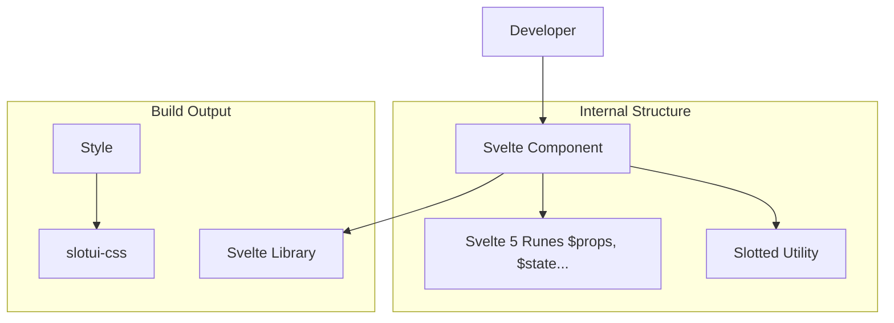

# @medyll/idae-slotui-svelte

This package is part of the Idae monorepo and focuses on providing slot UI components for Svelte applications.  
It aims to offer a set of reusable and customizable slots to enhance the development of web applications.

## Features

- **Reusable Components**: Prebuilt slot-based components to speed up development.
- **Customizable**: Easily adapt components to fit your application's design and functionality.
- **Svelte Integration**: Designed specifically for Svelte, ensuring seamless integration.
- **Lightweight**: Minimal dependencies for optimal performance.

## Installation

To install the package, use your preferred package manager:

```bash
npm install @medyll/idae-slotui-svelte
# or
yarn add @medyll/idae-slotui-svelte
# or
pnpm add @medyll/idae-slotui-svelte
```

## Usage

Import and use the components in your Svelte application:

```svelte
<script>
    import { SlotComponent } from '@medyll/idae-slotui-svelte';
</script>

<SlotComponent>
    <div slot="header">Header Content</div>
    <div slot="body">Body Content</div>
    <div slot="footer">Footer Content</div>
</SlotComponent>
```

## Contributing

Contributions are welcome! Please refer to the [contribution guidelines](../../CONTRIBUTING.md) for more details.


## Architecture



## Migration note
- SCSS support has been removed. All styling now uses Tailwind CSS and PostCSS.
- If you encounter errors, ensure `@tailwindcss/postcss` is installed and referenced in `postcss.config.cjs`.

## License

This package is licensed under the MIT License. See the [LICENSE](../../LICENSE) file for more information.
