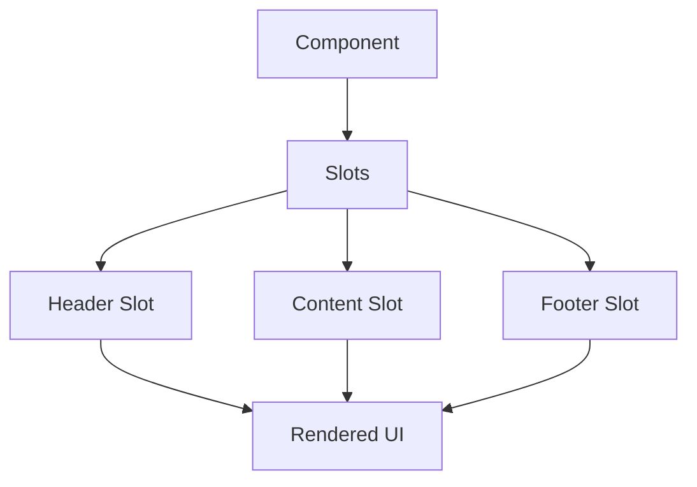

# idae-slotui

A Svelte 5 component library for building modular and reactive user interfaces.

## Architecture


```mermaid
graph TD
    A[Component] --> B[Slots]
    B --> C[Header Slot]
    B --> D[Content Slot]
    B --> E[Footer Slot]
    C --> F[Rendered UI]
    D --> F
    E --> F
```

## Features

- Svelte 5 components
- Slot system
- Reactive props
- Type-safe
- Modular design

## Installation

```bash
npm install @medyll/idae-slotui
pnpm add @medyll/idae-slotui
```

## Documentation

For more information, visit the [main documentation](../../README.md)

## License

MIT
