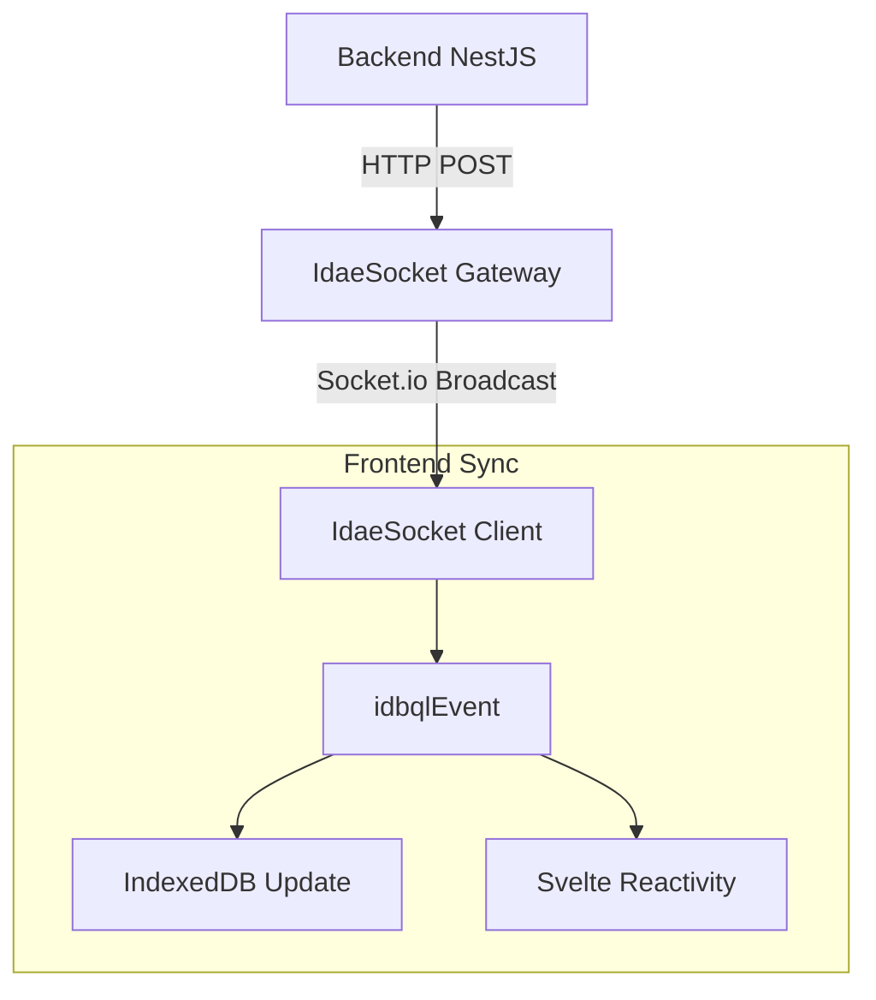

# @medyll/idae-socket

**Real-time synchronization bridge for Idae applications.**

`idae-socket` acts as a **hybrid HTTP/WebSocket gateway**. It enables your backend services to push real-time updates to frontend clients by simply converting HTTP POST requests into Socket.IO events. This allows any standard REST API or backend process to trigger interface updates without maintaining its own WebSocket state.

## 🚀 Features

- **HTTP-to-Socket Bridge**: POST to an endpoint, emit a socket event.
- **Room & User Targeting**: Dispatch events to specific rooms (roles) or individual connected users.
- **Microservice Ready**: Decouples the WebSocket service from the main business logic API.
- **Dual Drivers**: 
  - `HttpDriver`: Server-side ingress (Express + Socket.IO).
  - `SocketDriver`: Client-side connector for Node.js or browsers.

## 📦 Installation

```bash
pnpm add @medyll/idae-socket
```

## 🛠️ Usage

### 1. Server-side (The Gateway)

Start the socket server which will listen for both WebSocket connections and HTTP POST trigger requests.

```typescript
import { HttpDriver } from '@medyll/idae-socket';

// Start the server on port 4000
const server = new HttpDriver();
server.listen(4000);

console.log('idae-socket running on port 4000');
```

The server automatically exposes routes defined in your configuration (mapped to events).

### 2. Client-side (Frontend / Node Client)

Connect to the socket server to receive updates.

```typescript
import { EventDataClientInstance } from '@medyll/idae-socket';

const client = new EventDataClientInstance();

// Configure connection
client.config.host = 'http://localhost';
client.config.port = 4000;
client.config.authentication = {
    authMode: 'Bearer',
    auth: 'your-token-here'
};

// Handle connection events
client.onConnect = ({ socketId }) => console.log('Connected:', socketId);
client.onDisconnect = () => console.log('Disconnected');

// Connect
client.connect();

// Listen for specific events handled by your app
client.socket.on('collection:update', (data) => {
    console.log('Received update:', data);
    // Trigger UI refresh or idbql sync
});
```

### 3. Triggering Events (From Backend)

To push data to clients, your backend (e.g., NestJS) sends a standard HTTP POST request to the `idae-socket` service.

**Endpoint:** `POST http://localhost:4000/<eventName>`

**Body:**
```json
{
  "payload": {
    "entity": "users",
    "action": "update",
    "id": 123
  },
  "rooms": ["admin"],  
  "sender": {
    "roles": ["system"]
  }
}
```

- **`rooms`**: Array of rooms (or roles) to broadcast to.
- **`payload`**: The actual data to send to clients.
- **`payload.own`**: (Optional) Specify a user ID to target a specific user.

## 🔐 Authentication

`idae-socket` supports multiple authentication strategies to secure WebSocket connections.

### Configuration
Set the strategy via environment variables:

| Strategy | Env Var `IDAE_SOCKET_AUTH_STRATEGY` | Description |
|----------|-------------------------------------|-------------|
| **JWT** | `jwt` | Validates a Bearer token locally using `jsonwebtoken`. |
| **Introspection** | `introspection` | Validates the token by calling an external API. |
| **None** | `none` | Allows all connections (Dev only). Logs a warning. |

### 1. JWT SStrategy pattern implemented (JWT/Introspection). Currently defaults to "Soft-pass" (logs warning on failure) to facilitate migration.
- **Transport**: Modernized stack (Express native middlewares, Fetch API)
```bash
IDAE_SOCKET_AUTH_STRATEGY=jwt
IDAE_SOCKET_JWT_SECRET=your-super-secret-key
```

### 2. Introspection Strategy
Delegates validation to your main backend API via a POST request. The validator sends `{ token: "..." }` to the specified URL.
```bash
IDAE_SOCKET_AUTH_STRATEGY=introspection
IDAE_SOCKET_INTROSPECTION_URL=http://your-api.com/auth/verify
```

## ⚙️ Advanced Configuration

You can override the default configuration and environment variables by passing a config object to the `HttpDriver` (or `SocketIoServer`) constructor.

### Runtime Configuration
```typescript
import { HttpDriver, AuthStrategy } from '@medyll/idae-socket';

const server = new HttpDriver({
  defaultPort: 8080,
  corsOrigin: 'https://myapp.com',
  auth: {
    strategy: 'jwt',
    jwtSecret: 'runtime-secret-key',
    introspectionUrl: '' 
  },
  // Optional: Connection to Redis for horizontal scaling
  redisUrl: 'redis://localhost:6379' 
});

server.listen();
```

### Payload Mapping (Legacy Integration)
If your backend sends POST payloads that don't match the strict structure expected by `idae-socket` (e.g., from a legacy PHP app), you can provide a `payloadMapper` function to transform them on the fly.

```typescript
const server = new HttpDriver({
  payloadMapper: (legacyData) => {
    // Transform incoming data to expected format
    return {
      rooms: [legacyData.target_room],
      sender: {
        roles: ['SYSTEM'],
        // Pass external session info (cookies, PHPSESSID, etc.)
        cookie: legacyData.user_cookie 
      },
      payload: legacyData.content
    };
  }
});
```

## 🏗️ Architecture

1. **Backend Service** (e.g., `idae-api-nest`) modifies data.
2. **Backend** sends `POST /entity` to `idae-socket`.
3. **idae-socket** receives HTTP request via `HttpDriver`.
4. **Internal EventBus** emits the event.
5. **Socket.IO Server** broadcasts the payload to matching Clients (based on Rooms/Auth).
6. **Frontend** receives event and updates local state (e.g., via `idae-idbql`).

## ⚠️ Current Status

**Version**: 0.0.5

- **Auth**: Flexible Strategy pattern implemented (JWT / Introspection / None).
- **Transport**: Modernized stack (Native Fetch & Express, removed deprecated libs).
- **Scaling**: Redis Adapter fully supported for clustering.
- **Integration**: Supports payload mapping for legacy systems.


## Architecture



## License

ISC
