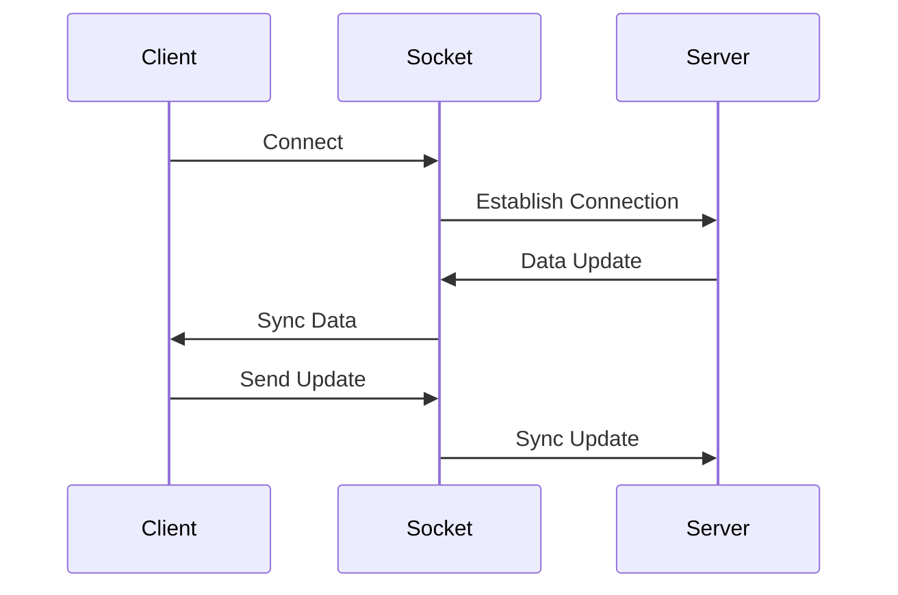

# idae-socket

Real-time synchronization library to keep your app in sync with your backend.

## Architecture


```mermaid
sequenceDiagram
    participant Client
    participant Socket
    participant Server
    Client->>Socket: Connect
    Socket->>Server: Establish Connection
    Server->>Socket: Data Update
    Socket->>Client: Sync Data
    Client->>Socket: Send Update
    Socket->>Server: Sync Update
```

## Features

- Real-time sync
- Automatic reconnection
- Data consistency
- Event-based
- Scalable

## Installation

```bash
npm install @medyll/idae-socket
pnpm add @medyll/idae-socket
```

## Documentation

For more information, visit the [main documentation](../../README.md)

## License

MIT
