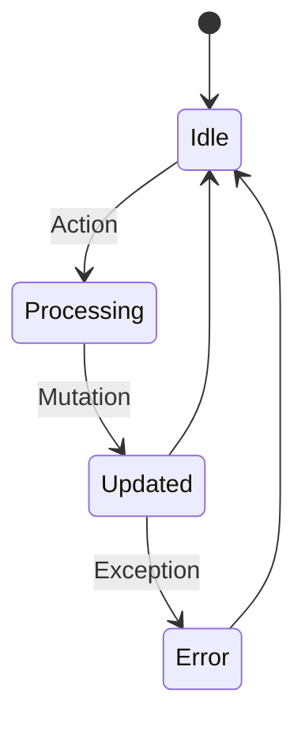

# idae-stator

A lightweight state management library for building reactive and scalable JavaScript applications.

## Architecture



## Features

- Reactive state
- Action handling
- Mutation tracking
- DevTools integration
- Lightweight API

## Installation

```bash
npm install @medyll/idae-stator
pnpm add @medyll/idae-stator
```

## Documentation

For more information, visit the [main documentation](../../README.md)

## License

MIT
