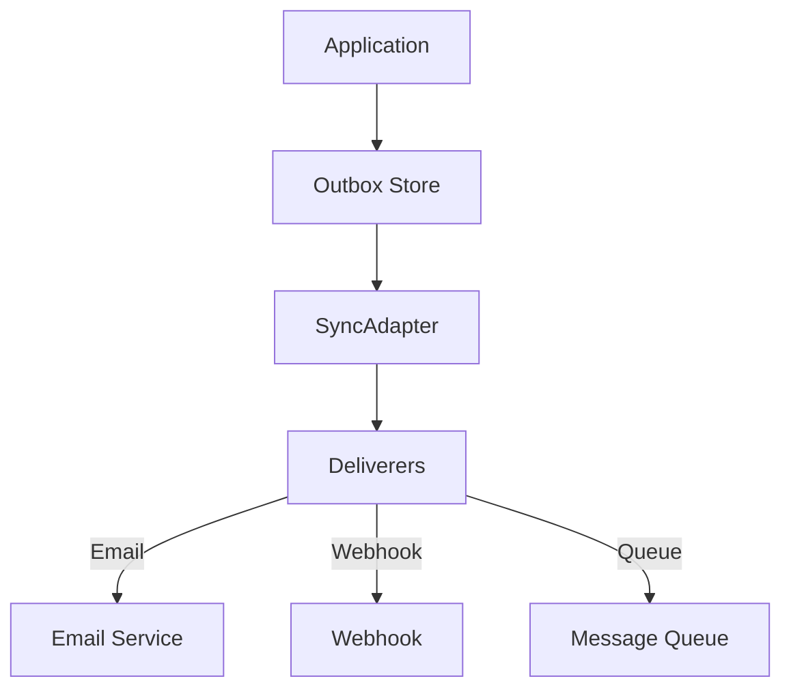

# idae-sync

Sync scaffolding for Idae with Outbox store, SyncAdapter, and deliverers.

## Architecture



## Features

- Outbox pattern
- Sync adapter
- Multiple deliverers
- Reliable delivery
- Event sourcing

## Installation

```bash
npm install @medyll/idae-sync
pnpm add @medyll/idae-sync
```

## Documentation

For more information, visit the [main documentation](../../README.md)

## License

MIT
