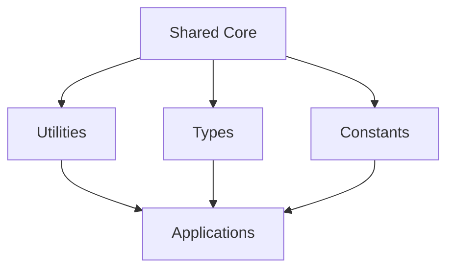

# shared

Shared utilities and dependencies for the Idae ecosystem.

## Architecture



## Features

- Shared utilities
- Common types
- Shared constants
- Reusable helpers
- Type-safe exports

## Installation

```bash
npm install @medyll/shared
pnpm add @medyll/shared
```

## Documentation

For more information, visit the [main documentation](../../README.md)

## License

MIT
